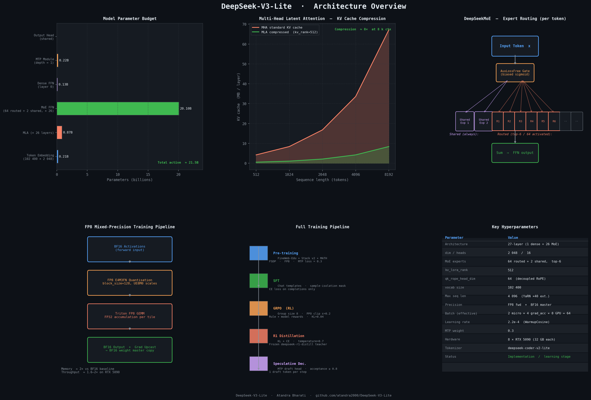

# DeepSeek-V3-Lite

A from-scratch reimplementation of the DeepSeek-V3 architecture in PyTorch — built to deeply understand every design decision: Multi-Head Latent Attention (MLA), DeepSeekMoE with aux-loss-free load balancing, FP8 mixed-precision training via custom Triton kernels, Multi-Token Prediction (MTP), and a full post-training pipeline (SFT → GRPO → R1 distillation).



> **Status:** Implementation / learning stage. All architecture and training code is written; pre-training has not started yet.

---

## Architecture at a Glance

```
Input tokens
    │
    ▼
 Embedding  (102 400 × 2 048)
    │
    ├─ Layer 0: Dense Transformer Block ─────────────────────────────────────┐
    │      MLA  →  SwiGLU FFN (standard, no experts)                         │
    │                                                                         │
    ├─ Layers 1–26: MoE Transformer Block ── × 26 ───────────────────────────┤
    │      MLA  →  DeepSeekMoE FFN                                            │
    │                │                                                        │
    │                ├─ 2 Shared Experts  (always active)                    │
    │                └─ 64 Routed Experts  (top-6 per token via biased gate) │
    │                                                                         │
    └─ RMSNorm  →  Linear head  →  logits                                    │
                                                                              │
 MTP Module (depth = 1) ─────────────────────────────────────────────────────┘
    Shared output head · predicts token t+2 alongside t+1
```

### Multi-Head Latent Attention (MLA)

Standard MHA caches `n_heads × head_dim` floats per token per layer.
MLA instead projects keys/values down to a **latent vector of rank 512**, achieving a 10–20× KV-cache reduction while recovering full attention quality via the absorption trick.

```
  x  ──W_DKV──►  c_kv  (B, T, kv_lora_rank=512)   # compressed latent
                   │
            ┌──────┴──────┐
          W_UK           W_UV
            │               │
          k_C  (×n_heads)  v  (×n_heads)
            │
          + k_R  (decoupled RoPE, qk_rope_head_dim=64)
```

**Absorption trick**: at inference, `W_UK` is folded into `W_Q` so the expanded key matrix never materialises — only `c_kv` is cached per token.

### DeepSeekMoE

```
token → AuxLossFreeGate → top-6 routed expert indices + 2 shared experts
                               │
                    Σ  gated SwiGLU expert outputs
```

Load balancing is achieved by a **bias term on each expert's gate logit**, updated after every step proportional to the deviation from the target token rate — no auxiliary loss gradient needed.

### FP8 Mixed-Precision

```
BF16 activation
      │
  act_quant_kernel  (Triton)  ──  block-wise E4M3FN, UE8M0 (power-of-two) scales
      │
  fp8_gemm_kernel   (Triton)  ──  tiled FP8×FP8 → FP32 accumulate → BF16 out
      │
BF16 output  ──  gradients upcast to BF16 master weights
```

FP8 is applied as a drop-in `FP8Linear` replacement for `nn.Linear`; a `replace_linear_with_fp8()` factory converts an existing model in-place.

### Multi-Token Prediction (MTP)

An auxiliary `MTPBlock` shares the output embedding head and predicts **token t+2** in parallel with the main head's prediction of **token t+1**. This improves training signal density and enables single-step speculative decoding at inference.

```python
loss = main_loss + mtp_loss_weight * mtp_loss   # weight = 0.3
```

---

## Repository Structure

```
DeepSeek-V3-Lite/
│
├── configs/
│   ├── pretrain_config.yaml       # vocab, model dims, FP8, MTP, training schedule
│   └── post-train_config.yaml     # SFT, GRPO, distillation, speculative decoding
│
├── models/
│   ├── transformer.py             # Top-level Transformer + generate()
│   ├── mla.py                     # Multi-Head Latent Attention + YaRN RoPE
│   ├── moe.py                     # AuxLossFreeGate + DeepSeekMoE
│   └── mtp.py                     # MTPBlock, MTPModule, MultiTokenPrediction
│
├── kernels/
│   ├── fp8_kernel.py              # Triton kernels: act_quant, weight_dequant, fp8_gemm
│   └── gemm.py                    # FP8Linear, STE autograd, replace_linear_with_fp8()
│
├── training/
│   ├── pretrain.py                # WarmupCosineDecay, PretrainDataset, FSDP Pretrainer
│   ├── sft.py                     # SFTDataset (sample-isolation), SFTTrainer
│   ├── rl.py                      # GRPOConfig, RewardModel, GRPOTrainer
│   └── distillation.py            # ReasoningDistillation (KL + CE, frozen teacher)
│
├── inference/
│   ├── generate.py                # Autoregressive generation + top-p sampling
│   └── speculative.py             # SpeculativeDecoder (MTP draft + acceptance test)
│
├── utils/
│   ├── checkpoint.py              # CheckpointManager: atomic saves, safetensors, FP8 scales
│   ├── communication.py           # MoE All-to-All dispatch, pipeline P2P comms
│   ├── distributed.py             # NCCL setup, all_reduce_mean, broadcast_object
│   └── logging.py                 # DistributedLogger: rolling loss, throughput, W&B
│
├── data/
│   └── prepare_data.py            # Download + tokenise FineWeb-Edu, Stack v2, MATH; SFT pack
│
├── assets/
│   ├── generate_plots.py          # 6-panel dark architecture chart
│   └── architecture_overview.png  # Generated overview figure
│
├── results/
│   └── training_status.md         # Live status: pending pre-training
│
├── .github/workflows/ci.yml       # Lint + model forward pass smoke tests
├── requirements.txt
└── README.md
```

---

## Key Design Decisions

| Decision | Rationale |
|---|---|
| **MLA over GQA** | 10–20× KV-cache reduction; absorption trick removes key expansion at decode time |
| **Aux-loss-free MoE balancing** | Gradient-based balance losses reduce token throughput; bias updates achieve balance without affecting task loss |
| **FP8 E4M3FN** | Halves VRAM vs BF16; Triton kernels allow custom block-size quantisation and power-of-two scales for numerics stability |
| **MTP depth = 1** | Single extra prediction head shares weights with output head; boosts training signal; directly enables 1-step speculative decoding |
| **FSDP over DDP** | Shards parameters + gradients + optimiser state across 8 GPUs; essential at 21 B param scale |
| **Decoupled RoPE** | RoPE applied only to a 64-dim subspace; content keys (128 dim) remain unrotated, preserving low-rank KV projection accuracy |
| **YaRN RoPE extension** | `rope_factor = 40` extends 4 k training context to 160 k at inference without retraining |

---

## Model Configuration

```yaml
# From configs/pretrain_config.yaml
model:
  vocab_size:          102400
  dim:                 2048
  n_layers:            27          # 1 dense + 26 MoE
  n_heads:             16
  n_routed_experts:    64
  n_shared_experts:    2
  n_activated_experts: 6           # top-6 routing
  kv_lora_rank:        512
  qk_nope_head_dim:    128
  qk_rope_head_dim:    64
  v_head_dim:          128
  mtp_depth:           1
  mtp_loss_weight:     0.3
  dtype:               fp8
  rope_factor:         40          # YaRN
```

---

## Training Pipeline

### 1. Pre-training

```bash
torchrun --nproc_per_node=8 training/pretrain.py --config configs/pretrain_config.yaml
```

- Dataset: FineWeb-Edu (general), The Stack v2-smol (code), MATH (lighteval)
- Schedule: 500-step linear warmup → cosine decay to 2.2e-5
- FSDP full-sharding across 8 × RTX 5090 (32 GB each)
- Checkpoints: safetensors weights + `.pt` optimiser state, atomic temp-rename

### 2. Supervised Fine-Tuning

```bash
torchrun --nproc_per_node=8 training/sft.py --config configs/post-train_config.yaml
```

- Chat template formatting; **sample-isolation mask** prevents loss bleeding across concatenated examples
- Loss computed only on assistant tokens

### 3. GRPO Reinforcement Learning

```bash
torchrun --nproc_per_node=8 training/rl.py --config configs/post-train_config.yaml
```

- Group size 8; generates 8 completions per prompt, ranks by reward
- Mixed rule-based (format/length/correctness) + learned reward model
- PPO clip ε = 0.2, KL penalty = 0.04 against frozen reference

### 4. R1 Reasoning Distillation

```bash
torchrun --nproc_per_node=8 training/distillation.py --config configs/post-train_config.yaml
```

- Teacher: `deepseek-ai/deepseek-r1-distill-qwen-7b` (frozen)
- Loss: `0.5 × KL + 0.5 × CE` at temperature 0.7

---

## Inference

### Standard generation

```python
from models.transformer import Transformer
from inference.generate import generate_interactive

model = Transformer.from_pretrained("checkpoints/final")
generate_interactive(model, tokenizer, max_new_tokens=512, temperature=0.7, top_p=0.9)
```

### Speculative decoding (via MTP draft)

```python
from inference.speculative import SpeculativeDecoder

decoder = SpeculativeDecoder(model, draft_steps=1, acceptance_threshold=0.8)
tokens  = decoder.generate(prompt_ids, max_new_tokens=512)
```

The MTP head produces a draft for token `t+2`; if the main model's probability ratio exceeds 0.8 the draft is accepted, doubling throughput in the best case.

---

## Data Preparation

```bash
python data/prepare_data.py --datasets fineweb,stack,math \
    --output_dir data/ --tokenizer deepseek-ai/deepseek-coder-v2-lite
```

Produces flat `.bin` packed token tensors for pre-training and formatted `.jsonl` for SFT.

---

## Setup

```bash
git clone https://github.com/atandra2000/DeepSeek-V3-Lite
cd DeepSeek-V3-Lite
pip install -r requirements.txt
```

Triton kernels require `triton >= 3.0.0` and a CUDA-capable GPU. CPU fallback is available in `kernels/gemm.py`.

---

## References

- [DeepSeek-V3 Technical Report](https://arxiv.org/abs/2412.19437) — architecture, MLA, MoE design
- [DeepSeekMoE](https://arxiv.org/abs/2401.06066) — fine-grained expert decomposition
- [DeepSeek-R1](https://arxiv.org/abs/2501.12948) — GRPO + reasoning distillation
- [Multi-Token Prediction](https://arxiv.org/abs/2404.19737) — training efficiency via auxiliary prediction heads
- [YaRN](https://arxiv.org/abs/2309.00071) — efficient long-context RoPE extension
- [Triton](https://triton-lang.org/) — GPU kernel programming for FP8 ops
