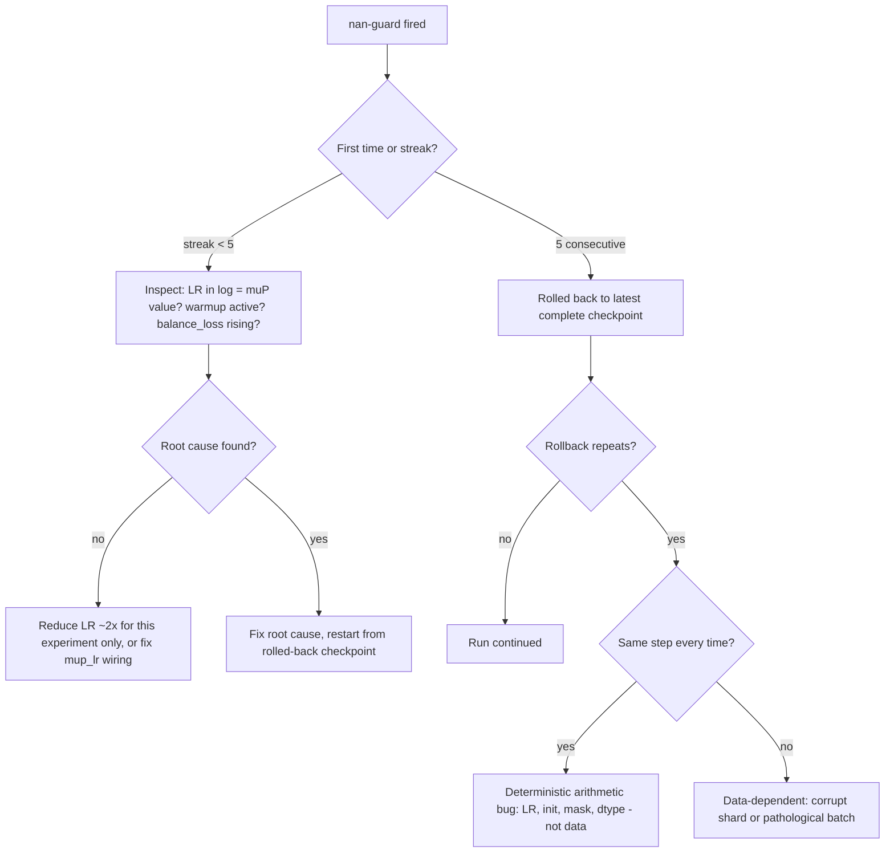
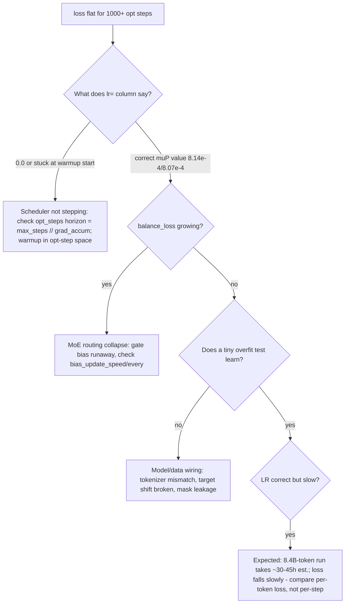

# G1 — Debugging Playbook: NaN Guard, Shape Errors, Cache Bugs, Triton Fallback

> **Canonical** for "something is wrong" in DeepSeek-v3-Lite: how the NaN guard trips and rolls back, the shape contracts that produce the classic `RuntimeError`s, the two distinct Triton-fallback mechanisms (and why the canonical config always uses the PyTorch MoE path), the KV-cache lifecycle traps, and decision trees for "loss not decreasing" and "divergence". Procedural guide — the surrounding theory lives in [[Docs/08_Training_Pipeline]], [[Docs/11_Operations_and_Testing]], and the API references [[reference/R7_training_api|R7]] / [[reference/R3_mla_api|R3]] / [[reference/R6_triton_api|R6]].

> **Status:** everything below is implemented and covered by the CPU test suite (196 nodes: 186 pass + 10 GPU-gated skips, see [[Docs/11_Operations_and_Testing]]), but **no GPU training run has ever executed** — `checkpoints/` is empty, so any timing, memory, or loss-curve figure quoted here as "expected" is an estimate, not a measurement.

**Depends on:** [[Docs/08_Training_Pipeline]] · [[Docs/11_Operations_and_Testing]] · **Read next:** [[guides/G2_mup_and_lr_tuning]] (the LR side of a NaN), [[guides/G5_checkpoint_ops]] (what rollback restores), [[guides/G3_triton_development]] (kernel-side fallbacks)

---

## 1. 60-Second Summary

Training never silently dies: if the loss becomes NaN or Inf, the guard in `training/pretrain.py:Pretrainer.train_step` skips that micro-step, and if five consecutive steps fail, `training/pretrain.py:Pretrainer.train` rolls the run back to the newest complete checkpoint (weights + optimizer + scheduler + step counters). Shape errors come from three contracts — the causal-mask geometry `models/transformer.py:Transformer._build_causal_mask`, the cross-entropy flatten, and the KV-cache write/read slices — and each has a one-line diagnosis. "Triton is not running" has two independent causes that people routinely confuse: a construction-time env-var force-back (`models/_triton_dispatch.py:enforce_triton_env_var`) and a per-call runtime fallback (`models/mla.py:MultiHeadLatentAttention.forward`, `models/moe.py:DeepSeekMoE.forward`) — at the canonical config the MoE kernel *always* falls back by design because its register dims are capped. Finally, the KV cache silently drops its contents whenever the batch size grows, so batch changes demand an explicit `models/transformer.py:Transformer.reset_cache`.

Every section ends with concrete commands and the exact log line to grep for.

---

## 2. Failure-Mode Index

| Symptom | Jump to | Key anchor |
|---|---|---|
| Loss becomes NaN / Inf | §3 | `training/pretrain.py:Pretrainer.train_step` |
| `[nan-guard] N consecutive NaN/Inf — restoring…` | §3.2–3.3 | `training/pretrain.py:Pretrainer.train` |
| SDPA size mismatch inside attention | §4.1 | `models/transformer.py:Transformer._build_causal_mask` |
| CE shape asserts, or loss counts padding | §4.2 | `training/pretrain.py:Pretrainer.train_step` |
| Embedding `IndexError`, garbage tokens | §4.4 | `training/pretrain.py:PretrainDataset._locate` |
| `[warn] Triton dispatch keys set without ENABLE_TRITON_KERNELS=1` | §5.1 | `models/_triton_dispatch.py:enforce_triton_env_var` |
| `[moe] triton_grouped unavailable (ValueError…)` | §5.2 | `models/moe.py:DeepSeekMoE.forward` |
| `[mla] triton attn_impl unavailable (…)` | §5.1 | `models/mla.py:MultiHeadLatentAttention.forward` |
| Output correct first call, wrong after batch change | §6 | `models/mla.py:MultiHeadLatentAttention._ensure_cache` |
| Loss flat, or loss exploding | §7 | — |

---

## 3. NaN / Inf

### 3.1 How the guard works

The guard is a **tripwire with a rollback state machine**, not a fix. The tripwire lives at the top of `train_step`, immediately after the loss is computed (inside the autocast context, so the checked value is the *real* training loss — including the weighted MTP term when `mtp_depth > 0` and `mtp_weight > 0`):

```python
if self.config.nan_guard and (torch.isnan(loss).any().item() or torch.isinf(loss).any().item()):
    self._log(f"[nan-guard] NaN/Inf at micro_step={micro_step}, opt_steps={self._opt_steps}. Skipping backward.")
    self.optimizer.zero_grad(set_to_none=True)
    return None
```

Returning `None` is the signal to the loop. `training/pretrain.py:Pretrainer.train` counts consecutive `None`s:

```python
nan_guard_streak = 0
while global_step < self.config.max_steps:
    for tokens, targets in tqdm(loader):
        ...
        metrics = self.train_step(tokens, targets, global_step)
        if metrics is None:
            nan_guard_streak += 1
            if nan_guard_streak >= self.config.nan_guard_max_consecutive:
                latest = self._find_latest_checkpoint()
                if latest is not None:
                    self._log(f"[nan-guard] {nan_guard_streak} consecutive NaN/Inf — restoring checkpoint step {latest}.")
                    global_step = self.load_checkpoint(latest)
                else:
                    self._log("[nan-guard] No checkpoint to restore from. Aborting.")
                    raise RuntimeError("NaN/Inf with no checkpoint to restore from")
                nan_guard_streak = 0
            continue
        nan_guard_streak = 0
```

The state machine, precisely:

1. **Skip, don't step.** A NaN micro-step contributes nothing to gradients, and the optimizer step for that accumulation window fires with one fewer micro-batch (the cadence stays aligned because `global_step` still advances). This is deliberate: the alternative — running a poisoned step — is worse.
2. **Count streaks, not totals.** Interleaved good steps reset the counter. Five *consecutive* failures (canonical `nan_guard_max_consecutive: 5`) trigger rollback; a single bad shard that produces one NaN per epoch will never hit the threshold.
3. **Roll back to the newest *complete* checkpoint.** `self._find_latest_checkpoint()` delegates to `utils/checkpoint.py:CheckpointManager.latest_step`, which only returns steps where all three files (`model_step_N.safetensors`, `optim_step_N.pt`, `meta_step_N.json`) exist.
4. **Restore everything except the sampler.** `training/pretrain.py:Pretrainer.load_checkpoint` restores weights, optimizer state, scheduler state, and `opt_steps` (the LR schedule's position). It does **not** restore the DataLoader's shuffle RNG, so the token order after rollback differs — benign at this scale (see the comment in `train()`), but it means the corrupting batch may not re-appear immediately.
5. **No checkpoint → hard abort.** A NaN before the first `save_every` boundary raises `RuntimeError`, because there is nothing consistent to go back to.

Config keys: `nan_guard` (default `False` in `training/pretrain.py:TrainingConfig`, `true` in the canonical config) and `nan_guard_max_consecutive` (default 5).

**Verify the mechanism locally** (CPU, no data needed — this is the repo's own test):

```bash
python -m pytest tests/test_training.py -v            # includes TestNanGuardRollback
```

**Why it exists:** BF16 training diverges differently from FP32 — an Inf in one logit position poisons softmax/CE silently, and autocast masks the first sign. A guard that fires *at the loss*, before backward, is the cheapest correct tripwire: it never lets a poisoned gradient reach AdamW.

### 3.2 What to check when it fires

Work the checklist in order — the last item is the most common real cause.

- [ ] **LR: is it the μP value, or something else?** The canonical config sets `mup_lr: true`; `Pretrainer.__init__` overrides `lr` at construction:
  `new_lr = config.mup_lr_reference * (config.mup_lr_reference_params / total) ** 0.5`, with the reference anchored at `6.0e-4` @ 757\,226\,496 params → **8.14e-4** for the 411.6M base model, **8.07e-4** with MTP (418.7M). The startup log prints `µP LR scaling: 8.00e-04 → 8.14e-04 (ref 6.00e-04 @ 757,226,496 params)`. If you instead see the raw `2.2e-4` dataclass default or the config's `8.0e-4` in the `lr=` column, `mup_lr` was silently off (typo, nested-config key shadowing) — and an 8e-4-class LR on an un-μP'd model is a classic diverge recipe. See [[guides/G2_mup_and_lr_tuning]].
- [ ] **Is warmup actually running?** The scheduler horizon is the *opt-step* count: `opt_steps = max(1, config.max_steps // config.gradient_accumulation_steps)` → 512\,000 // 4 = **128\,000** opt steps for the canonical run, and `warmup_steps: 2000` is in that same space (2000 optimizer steps ≈ 8000 micro-steps). A model whose LR jumps straight to 8e-4 (e.g. scheduler never stepped, or horizon computed in micro-steps) shows the first NaN inside the first thousand micro-steps. `training/pretrain.py:make_warmup_cosine_lambda` is the closed form.
- [ ] **MoE routing spikes.** The aux-loss-free gate pushes expert *counts* toward balance by nudging biases (`models/moe.py:DeepSeekMoE.update_gate_bias`, `bias_update_speed: 0.001`, `bias_update_every: 1` canonical). If routing collapses onto one expert, that expert's weights see a large fraction of the tokens and can blow up. The log's `balance_loss=…` column (from `models/moe.py:DeepSeekMoE.get_load_balance_loss`, logged by `utils/logging.py:TrainingLogger.log`) should hover near `n_activated_experts = 4` — a balance_loss climbing toward 20 (all routed tokens to one of 20 experts) is a routing crash, not an arithmetic one.
- [ ] **Shard corruption.** Tokens are stored as uint32 mmap'd shards (`shard_*.bin`). A corrupted shard can yield tokens `≥ vocab_size` — which raises `IndexError` in `nn.Embedding` (shape section, §4.4) — or, worse, in-range but garbage tokens that spike the loss for exactly one batch. Because rollback does *not* restore the sampler RNG, a data-corruption NaN recurs at a different step each time; a deterministic NaN at the same step is arithmetic, not data. Rebuild with `python3 data/prepare_data.py --stage pretrain`, or use the tiny local shard builder `python scripts/build_small_pretrain_data.py --tokenizer gpt2 --source synthetic --target-tokens 200000`.
- [ ] **Dtype at the boundary.** Inputs arrive as uint32; `train_step` casts to `torch.long` (`if tokens.dtype != torch.long: tokens = tokens.to(torch.long)`) before embedding/CE. If you bypass `Pretrainer.train_step` or `models/transformer.py:Transformer.forward` with raw tensors (custom loop, notebook), cast yourself — a uint32 index into `nn.Embedding` fails or silently misbehaves depending on PyTorch version.
- [ ] **Grad norm at the clip.** `max_grad_norm: 1.0` clips *after* backward, so it cannot prevent a NaN loss — it only bounds the update. If you see `loss` fine and `nan` appearing after a few opt steps with `lr` correct, suspect the clip value interacting with BF16 weight updates; the guard can't see grad-norm spikes that don't materialize as loss NaN until later.

### 3.3 Decision tree: `[nan-guard]` fired



The single most diagnostic question is **"does rollback land on the same micro-step every time?"** Same step → arithmetic (weights/LR/mask/dtype); different steps → data or routing.

---

## 4. Shape Errors

### 4.1 The causal-mask geometry contract

`models/transformer.py:Transformer._build_causal_mask` builds the additive mask used by every attention path (SDPA and manual; the Triton kernel gets causality via a `q_start` offset instead):

```python
def _build_causal_mask(self, seqlen: int, kv_len: int, start_pos: int, device: torch.device) -> torch.Tensor:
    key = (seqlen, kv_len, start_pos, device)
    if self._mask_cache is None or key != self._mask_key:
        q = torch.arange(seqlen, device=device)[:, None] + start_pos
        k = torch.arange(kv_len, device=device)[None, :]
        mask = torch.where(q >= k, torch.zeros((), device=device), torch.full((), float("-inf"), device=device))
        self._mask_cache = mask.unsqueeze(0).unsqueeze(0)
        self._mask_key = key
    return self._mask_cache
```

The contract, exactly as the callers in `models/transformer.py:Transformer.forward` implement it:

- Output shape is **(1, 1, S_q, S_kv)** — `S_q = seqlen`, `S_kv = kv_len`.
- Causality is by **global** position: query row $i$ (global position `start_pos + i`) may attend key $j$ iff `start_pos + i >= j`. A mask that is causal only *within the chunk* (i.e. built with `start_pos=0`) lets a cached mid-sequence prefill attend its own future — the exact bug pinned by `tests/test_models.py::test_chunked_prefill_matches_full_forward`.
- The caller passes `kv_len = end_pos` **iff** `use_cache` (where `end_pos = start_pos + seqlen`), else `kv_len = seqlen`; and `start_pos` is passed as `0` when cache-free. Getting either wrong produces the two classic symptoms: an SDPA `RuntimeError` when `S_kv` doesn't match the key tensor, or silent future leakage when it does.
- **Single-token decode (`seqlen == 1`) bypasses the mask entirely** (`mask = None`). A bug that only appears at `seqlen > 1` is a mask bug, not an attention bug.
- The mask is cached by `(seqlen, kv_len, start_pos, device)` — cheap to regenerate, but note that device is part of the key: a model moved between devices after the first forward rebuilds the mask (correct, just not free).

**Repro command** (runs both `attn_impl="sdpa"` and `"manual"`):

```bash
python -m pytest tests/test_models.py -k chunked -v
```

If it fails, print the mask and inspect the `(S_q, S_kv)` block against `start_pos`: for a 16-token sequence with `start_pos=8`, the lower-right `8×16` block must be causal with its diagonal at *global* position 8.

### 4.2 The cross-entropy reshape

The non-MTP path flattens logits and targets before CE:

```python
main_loss = torch.nn.functional.cross_entropy(logits.reshape(-1, logits.size(-1)), targets.reshape(-1), ignore_index=-100)
```

Three failure modes, in order of frequency:

1. **Forgetting `ignore_index=-100`.** The repo never pads with zeros — it packs tokens end-to-end (`training/pretrain.py:PretrainDataset._locate` handles cross-shard windows; `PretrainDataset.__getitem__` returns `chunk[:-1], chunk[1:]`). But if you bring your own dataset with padding and drop `ignore_index`, pad positions become real gradient contributors and the loss is silently wrong (lower than it should be — it "learns" to predict pad).
2. **`(B, S)` targets vs `(B, S, V)` logits.** The flatten `(-1, V)` / `(-1)` makes CE's shape check fail loudly only if token counts mismatch; if you pass targets of shape `(B, S, V)` (one-hot), you get a rank mismatch inside CE, not a clean message.
3. **MTP length alignment.** The MTP path has a *second* alignment: `models/mtp.py:MultiTokenPrediction.compute_loss` receives pairs already length-aligned to `usable = seq_len - d - 2` (depth-1: `seq_len - 3` targets per depth), and a mismatch there asserts inside `F.cross_entropy`, not in the model. If your MTP loss shape-asserts, check the slicing in `MultiTokenPrediction.forward`, not the CE call.

### 4.3 Cache write/read slices

`models/mla.py:MultiHeadLatentAttention.forward` writes and reads the cache with the same `bsz`-first indexing:

```python
if use_cache:
    self.kv_cache[:bsz, start_pos:end_pos] = kv_normed.detach()
    self.pe_cache[:bsz, start_pos:end_pos] = k_pe.detach()
    ctx_kv = self.kv_cache[:bsz, :end_pos]
    ctx_pe = self.pe_cache[:bsz, :end_pos]
```

The shape contract: cache tensors are `(new_bsz, max_seq_len, kv_lora_rank)` and `(new_bsz, max_seq_len, qk_rope_head_dim)` — MLA caches the *compressed latent* `(d_c + d_R) = 216` floats/token/layer, not per-head K/V (see [[Docs/03_Multi_Head_Latent_Attention]] and [[reference/R3_mla_api|R3]]). Write and read must agree on `bsz`, `start_pos`, `end_pos`; a mismatch shows up as an SDPA size error when `:end_pos` disagrees with the mask's `kv_len`, or as garbage logits when the write slice is wider than the read slice (future tokens overwrite past ones). Also: `end_pos > max_seq_len` raises `RuntimeError(f"Layer {self.layer_idx}: end_pos {end_pos} exceeds max_seq_len {self.max_seq_len}")` — the "context too long" error, not a mask error.

### 4.4 Shape-error checklist

- [ ] Inputs are `torch.long` (uint32 → long cast at `train_step`/`Transformer.forward`).
- [ ] Mask: `(1,1,S_q,S_kv)`, `kv_len = end_pos if use_cache else seqlen`, causal by global position (§4.1).
- [ ] CE: targets `(B,S)`, logits `(B,S,V)`, `ignore_index=-100` (§4.2).
- [ ] Cache slices agree on `bsz`/`start_pos`/`end_pos`; `end_pos ≤ max_seq_len` (§4.3).
- [ ] All token ids `< vocab_size` (else `IndexError` from `nn.Embedding` — check shard contents; `training/pretrain.py:PretrainDataset._locate` raises `IndexError` for out-of-range *global* indices, so a short shard surfaces as an index error, not a shape error).

---

## 5. Triton Fallback Diagnostics

There are **two independent mechanisms** that end with "the Triton path did not run". Confusing them is the most common ops mistake in this repo.

### 5.1 Mechanism 1 — construction-time env-var force-back

`models/_triton_dispatch.py:enforce_triton_env_var` runs inside `models/transformer.py:Transformer.__init__` (and again as a no-op in `Pretrainer.__init__`). If the config contains a Triton dispatch value but `ENABLE_TRITON_KERNELS != "1"`, it rewrites the keys **in the config dict** and logs **one** warning (never per-layer):

```
[warn] Triton dispatch keys set without ENABLE_TRITON_KERNELS=1; forcing attn_impl='triton' -> 'sdpa'. Set ENABLE_TRITON_KERNELS=1 to enable the fused Triton paths.
```

The dispatch table is a single source of truth: `("attn_impl", "triton") → "sdpa"` and `("moe_dispatch", "triton_grouped") → "stacked"`. This is a *policy* guard (Triton is opt-in), pinned by `tests/test_force_back.py`.

**Diagnosis:** the warning appears **at construction**, before any forward. If you set the env var and still see it, the env didn't reach the process — `ENABLE_TRITON_KERNELS=1 python training/pretrain.py …` must prefix the launch; a wrapper script that exports it *after* Python starts does not count.

### 5.2 Mechanism 2 — runtime fallback (per call, in `forward`)

Even with the env var set, each layer independently *tries* its Triton path and falls back on failure. MLA (`models/mla.py:MultiHeadLatentAttention.forward`):

```python
try:
    return self._forward_triton(...)
except (ImportError, ValueError) as exc:
    if not getattr(self, "_triton_fallback_warned", False):
        print(f"[mla] triton attn_impl unavailable "
              f"({type(exc).__name__}: {exc}); "
              f"falling back to 'sdpa' for this model.")
        self._triton_fallback_warned = True
    self.attn_impl = "sdpa"
```

MoE (`models/moe.py:DeepSeekMoE.forward`) does the same for `triton_grouped`, falling back to `_routed_forward_stacked` with a one-time `[moe] triton_grouped unavailable (…); falling back to 'stacked' for this model.` warning. Two subtle differences from the force-back:

- This warning appears at **forward time**, and the fallback **persists** for MLA (it rewrites `self.attn_impl = "sdpa"`) while MoE falls back **per call** (the dispatch key is left intact — the module re-tries next forward).
- The fallback is **correctness-safe**: the stacked path (`models/moe.py:DeepSeekMoE._routed_forward_stacked`, the original per-expert loop) and the SDPA path are the reference implementations the kernels are tested against. You lose speed, not results.

### 5.3 The canonical-config register cap (the gotcha)

The grouped-MoE kernel hard-fails on register pressure:

```python
def _check_dim_limits(I: int, D: int) -> None:
    if I > 256 or D > 256:
        raise ValueError(
            f"triton_grouped_moe_dispatch: BLOCK_I=ceil_pow2({I}) and "
            f"BLOCK_D=ceil_pow2({D}) must each be ≤ 256. Got I={I}, D={D}. "
            "For larger dims, fall back to `moe_dispatch='stacked'`."
        )
```

The canonical config has `moe_inter_dim: 384` (I) and `dim: 768` (D) — **both exceed 256**, so with `moe_dispatch: "triton_grouped"` the kernel raises `ValueError` on every forward and the module prints the fallback warning once, then runs stacked **forever**. This is structural, not a bug: the kernel is valid at smoke-config dims (I, D ≤ 256, e.g. `configs/pretrain_1650_2m.yaml` has `moe_inter_dim: 32`, `dim: 64`). The MLA kernel has **no such cap at canonical dims** — `kv_lora_rank=192`, `qk_nope=48`, `qk_rope=24`, `v=64` all fit, and sequence length is tiled — so the MLA fused path *can* activate on the canonical config. Full register-budget math: [[Docs/12_Triton_Kernels]] and [[reference/R6_triton_api|R6]].

### 5.4 Determining which path a run actually executed

```bash
# 1. Launch with the opt-in env var
ENABLE_TRITON_KERNELS=1 python training/pretrain.py --config configs/pretrain_a100_422m.yaml

# 2. At construction: force-back warning present?
grep -n "Triton dispatch keys set" checkpoints/pretrain_a100/train.log
#    → absent = force-back passed (env var reached the process)

# 3. At forward time: runtime fallback warnings?
grep -n "\[moe\] triton_grouped unavailable" checkpoints/pretrain_a100/train.log
grep -n "\[mla\] triton attn_impl unavailable" checkpoints/pretrain_a100/train.log
#    → [moe] present at the canonical config = EXPECTED (register cap §5.3),
#      and the MoE numbers in any benchmark reflect the stacked path
```

Both halves of this contract are pinned by `tests/test_moe_triton.py` (`test_triton_path_falls_back_cleanly_on_cpu`, `test_kernel_call_raises_value_error_on_too_large_dim`) and the GPU-gated equivalence tests. **Never anchor or import the JIT kernel symbols** (`_grouped_moe_fwd_kernel`, `_mla_flash_fwd_kernel`, …) — the documented boundary is the host wrapper (`models/mla_triton.py:triton_mla_attention`, `models/moe_triton.py:triton_grouped_moe_dispatch`), and `tests/test_doc_refs.py` rejects JIT symbols.

---

## 6. Cache Bugs: Batch Growth Drops Contents

The MLA cache is **not** batch-padded safely across calls. `models/mla.py:MultiHeadLatentAttention._ensure_cache` reallocates when anything about the allocation no longer fits:

```python
need_alloc = self.kv_cache is None or bsz > self._cache_batch or self.kv_cache.device != device or self.kv_cache.dtype != dtype
if not need_alloc:
    return
new_bsz = max(bsz, self._cache_batch * 2, 16)
self.kv_cache = torch.zeros(new_bsz, ...)
```

The reallocation is a **fresh `torch.zeros`** — existing contents are dropped, not copied. Concretely:

- Prefill batch 2 → decode batch 4: `bsz (4) > _cache_batch (2)` → new zero cache → the prefill context is gone, decode attends to zeros. Output is silently wrong (often degenerate repetitions), with **no error and no warning**.
- Same batch, different **dtype** (e.g. first forward in FP32 for inspection, then BF16): `need_alloc` fires on the dtype mismatch → contents dropped for the same reason.
- Same batch, same dtype, same device: the cache persists and grows by `end_pos` — the intended lifecycle (prefill `start_pos=0`, decode appends at `start_pos = prompt_len + step`).

**The fix is `models/transformer.py:Transformer.reset_cache`** (which fans out to `models/mla.py:MultiHeadLatentAttention.reset_cache` per layer): any change to `bsz`, device, or dtype between calls must be preceded by a reset, and the prefill redone. The two generation entry points already do this correctly: `models/transformer.py:Transformer.generate` calls `self.reset_cache()` before prefill (and restores `train()`/`eval()` mode), and `inference/speculative.py:SpeculativeDecoder.generate` resets the main model's cache the same way — so the *supported* entry points are safe; the trap is only for hand-rolled loops. The interactive REPL's `/clear` (in `inference/generate.py:generate_interactive`) resets the *message* context; the model cache is reset by the next `generate` call.

**Cache checklist**

- [ ] Same `bsz` for every forward in a hand-rolled decode loop; on any change: `model.reset_cache()` and re-prefill.
- [ ] Same dtype across cache-using calls (cache dtype follows the first forward's `x.dtype`).
- [ ] `start_pos` advances by exactly the number of tokens fed since the last call.
- [ ] Suspect a stale cache? `model.reset_cache()` is the first thing to try before debugging anything else — it is a 3-line operation and eliminates the whole class.

---

## 7. Decision Trees: Loss Not Decreasing / Divergence

### 7.1 "Loss is not decreasing"



Two decisive experiments, in order:

1. **Overfit a single batch.** Take one batch, train on it for a few hundred steps (tiny config: `--config configs/pretrain_1650_2m.yaml`, or the `small_cfg` fixture). A correct wiring drives loss toward 0. If it can't overfit one batch, the bug is in the model/data wiring (mask, targets, tokenizer), not the schedule. Run the wiring tests first: `python -m pytest tests/test_models.py -k "chunked or forward" -v` and `python -m pytest tests/test_training.py -v`.
2. **Check the tokenizer contract.** The canonical model has vocab 100\,018 (`deepseek-coder-v2-lite`); the tiny config uses GPT-2's 50\,257. Data built with the wrong tokenizer either crashes (ids ≥ vocab) or trains to a wrong loss floor — and "correct" losses are unknowable a priori here because **no GPU run has ever executed**: there is no published reference curve for this repo, so "expected loss" must come from a scaling-law estimate (see [[Docs/01_Foundations]]) or your own small-scale run, not from a checkpoint.

### 7.2 "Loss is diverging"

```mermaid
flowchart TD
    A[loss growing / spiking] --> B{NaN/Inf?}
    B -- yes --> C[Section 3: same step every rollback = arithmetic, else data/routing]
    B -- no --> D{Spikes then recovers?}
    D -- yes --> E[Single bad batch: corrupt shard or pathological sequence - check data around spike step]
    D -- no --> F{Steady growth from step 0?}
    F -- yes --> G[LR too high for the schedule: verify muP wiring, warmup, grad_clip]
    F -- no --> H{Diverges after N steps?}
    H -- yes --> I[Late-run instability: LR not decaying (horizon bug) or MoE expert collapse]
```

---

## 8. Check Your Understanding

1. The guard rolls back after 5 consecutive NaN micro-steps. What exactly is restored, and what is not?
2. You set `ENABLE_TRITON_KERNELS=1`, launch the canonical config, and still see `[moe] triton_grouped unavailable (ValueError…)`. Is something broken?
3. You prefill with `bsz=2`, then run decode with `bsz=4` and get degenerate output with no error. What happened and what's the fix?
4. When is the causal mask `None`, and why does that make single-token bugs invisible to mask tests?

<details>
<summary>Answers</summary>

1. `training/pretrain.py:Pretrainer.load_checkpoint` restores model weights, optimizer state, scheduler state, and `opt_steps` (so the LR arc resumes mid-course). The DataLoader shuffle RNG is not restored, so the token order after rollback differs.
2. No — that is the **expected** runtime fallback at canonical dims: `moe_inter_dim=384` and `dim=768` exceed the kernel's 256 register cap, so `models/moe.py:DeepSeekMoE.forward` falls back to stacked by design (§5.3). Only the MLA fused path can activate at the canonical config. `[moe]` warning ≠ bug.
3. `models/mla.py:MultiHeadLatentAttention._ensure_cache` reallocated the cache (`bsz 4 > _cache_batch 2`) into fresh zeros, dropping the prefilled context — silently. Fix: `model.reset_cache()` before the batch change and re-prefill (§6).
4. When `seqlen == 1` (single-token decode) in `models/transformer.py:Transformer.forward`, `mask = None` — there is nothing to mask. Bugs that only appear at `seqlen > 1` (cached mid-sequence prefill) are therefore mask bugs; the chunked-prefill test (§4.1) is the tool that finds them.
</details>

---

## 9. See Also

- [[Docs/08_Training_Pipeline]] — the loop, AdamW, scheduler, and the μP derivation behind §3.2.
- [[Docs/11_Operations_and_Testing]] — test-suite map, checkpoint format, and the ops-level view of the same guard/fallback contracts.
- [[Docs/12_Triton_Kernels]] — register-budget math and kernel design behind §5.
- [[reference/R7_training_api|R7 — Training API]] · [[reference/R3_mla_api|R3 — MLA API]] · [[reference/R6_triton_api|R6 — Triton API]] — per-symbol contracts.
- [[guides/G2_mup_and_lr_tuning|G2 — μP and LR tuning]] — the LR side of a NaN.
- [[guides/G5_checkpoint_ops|G5 — Checkpoint Ops]] — what the rollback state machine depends on.

<!-- docs:verified 2026-08-04 · 59aeef3 -->
