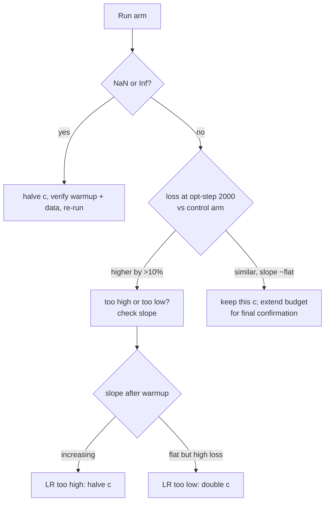

# DeepSeek-v3-Lite — μP & LR Tuning

> **Read this if** you are about to change the learning rate, run an LR sweep, or wonder why the `lr` you set in YAML is not the LR the run actually uses. **Skip if** you only need the pretrain-loop mechanics → [Training Pipeline](../training.md).

**Depends on:** [Training Pipeline](../training.md), [Foundations & Architecture](../concepts/foundations.md) §13 (μP intuition) · **Read next:** [Debugging Playbook](../guides/G1_debugging_playbook.md), [Benchmarking](../guides/G4_benchmarking.md)

---

## 60-second summary

DeepSeek-v3-Lite never uses a hand-picked learning rate at the canonical scale. With `mup_lr: true`, the effective base LR is computed at startup as

$$
\eta = 6.0\times10^{-4}\times\sqrt{\frac{757226496}{N}},
$$

where $N$ is the **deduped parameter count of the training model**: **8.14e-4** for the 411.6M base model, **8.07e-4** when the MTP head is attached (418.7M). The same startup code derives the scheduler horizon from the config as `max_steps // gradient_accumulation_steps` (128,000 optimizer steps for the canonical run), so the warmup + cosine arc completes in *optimizer-step* space, not micro-step space. This guide derives the formula with the real numbers, shows exactly where it is wired, and gives a checklist for sweeping the LR at this repo's scale.

> **Honesty note.** No GPU training run has been executed yet (`checkpoints/` is empty, `.benchmarks/` is empty). Every claim below about *expected* loss trajectories is heuristic guidance, not measured data — label any number you produce from a real run as measured and compare against these only as order-of-magnitude sanity.

---

## 1. Why this guide exists

Two failures motivated this guide, both of which will bite anyone who treats the YAML like a regular config:

1. **The `lr` key is inert.** The canonical config (`configs/pretrain_a100_422m.yaml`) carries `lr: 8.0e-4`, but with `mup_lr: true` that value is overwritten at `Pretrainer` construction. Tuning `lr` alone does nothing; the log line `µP LR scaling: 8.00e-04 → 8.07e-04` is the ground truth of what the run uses.
2. **The scheduler horizon is not `max_steps`.** `max_steps` counts micro-batches (each `train_step` call), while `scheduler.step()` fires once per optimizer step. If the cosine horizon were `max_steps`, the canonical run would stop after a quarter of the cosine arc and never reach `min_lr_ratio`. The code therefore rescales: the horizon is `max_steps // gradient_accumulation_steps` (see `training/pretrain.py:Pretrainer.__init__`), and `warmup_steps` is likewise interpreted in optimizer-step space.

Both are silent-failure modes: the run trains fine, the logs look fine, and only a careful read of the LR column reveals the schedule is not what you asked for.

---

## 2. Intuition — what the sqrt scaling is doing

**Geometric picture.** Think of each parameter update as a step of length $\eta \cdot \hat g$ in weight space. A wider model has more coordinates that can absorb or cancel an update, so the *same* step length produces a smaller change in the loss per parameter. To keep the per-parameter update "temperature" constant across scales, the step length must grow as the model widens — but not linearly.

**Why $\sqrt{N}$, not $N$.** Under μP (Yang et al.), the correct transfer law depends on how weights are initialized and how activations scale with width. For the standard width-scaling scheme used in this lineage (weight std ∝ $1/\sqrt{\text{fan\_in}}$, pre-norm residual stream), the AdamW-normalized update $\eta\, \hat m/\sqrt{\hat v}$ keeps its *relative* magnitude across widths when $\eta \propto 1/\sqrt{N}$ — equivalently, $\eta \sqrt{N}$ is the scale-invariant quantity. The repo encodes this as a single reference point: *"6.0e-4 was right for a 757,226,496-parameter model; keep $\eta\sqrt{N}$ constant and re-derive the LR for any other size."*

**The reference anchor.** The 757,226,496 figure is an *external* tuning anchor (a reference model this project was derived from) — it is not measurable in this repo, it is a constant to trust. What the repo *does* measure is $N$, via `models/transformer.py:count_parameters`, which deduplicates shared tensors by tensor id so weight tying (`head.weight` shares storage with `embed.weight`) is counted once.

---

## 3. The formula, with the real numbers

### 3.1 The μP law

$$
\eta(N) = \eta_{\text{ref}} \times \left(\frac{N_{\text{ref}}}{N}\right)^{1/2}, \qquad \eta_{\text{ref}} = 6.0\times10^{-4},\quad N_{\text{ref}} = 757226496.
$$

The variable $N$ is **not** the config's nominal size — it is the deduped total of the exact training model after MTP wrapping:

| Scenario | $N$ (deduped) | $\eta(N)$ | rounded |
|---|---|---|---|
| Base model, `mtp_loss_weight: 0` (no wrapper) | 411,632,256 | 8.1378e-4 | **8.14e-4** |
| Canonical config (MTP depth 1, λ = 0.3) | 418,713,984 | 8.0687e-4 | **8.07e-4** |

Worked check for the base case:

$$
\eta = 6.0\times10^{-4}\times\sqrt{757226496/411632256}
   = 6.0\times10^{-4}\times 1.3563 \approx 8.14\times10^{-4}.
$$

The MTP head adds ~7.1M parameters, so with the wrapper engaged $N$ grows and the LR drops by ~0.7% relative — a small but *automatic* correction, which is the point of the mechanism.

### 3.2 The scheduler law

`training/pretrain.py:make_warmup_cosine_lambda` returns a pure function of the optimizer-step counter $s$:

```python
def make_warmup_cosine_lambda(warmup_steps: int, total_steps: int, min_lr_ratio: float = 0.1):
    def lr_lambda(step: int) -> float:
        if step < warmup_steps:
            return step / max(1, warmup_steps)
        if step >= total_steps:
            return min_lr_ratio
        progress = (step - warmup_steps) / max(1, total_steps - warmup_steps)
        return min_lr_ratio + (1.0 - min_lr_ratio) * 0.5 * (1.0 + math.cos(math.pi * progress))
    return lr_lambda
```

Closed form, with $w$ = warmup steps, $T$ = horizon, $r$ = `min_lr_ratio`:

$$
\lambda(s) = \begin{cases}
s/w & 0 \le s < w \\[2pt]
r + (1-r)\,\frac{1+\cos(\pi \cdot (s-w)/(T-w))}{2} & w \le s < T \\[2pt]
r & s \ge T
\end{cases}
$$

The effective LR at optimizer step $s$ is $\eta(s) = \eta_{\text{base}} \cdot \lambda(s)$, since `LambdaLR` multiplies the optimizer's base LR by the lambda. The seams are exact (λ(w)=1, λ(T)=r, monotone in between) — the tests in `tests/test_training.py` (`TestWarmupCosineScheduler`) pin these values.

**Canonical numbers.** `total_steps: 512000` micro-batches, `gradient_accumulation_steps: 4` → horizon $T = 128000$ optimizer steps, each covering $8 \times 4 \times 2048 = 65\,536$ tokens (8.39B tokens over the run). `warmup_steps: 2000` is in **optimizer-step space** (8,000 micro-batches; ~1.6% of the horizon — the standard LLM order of magnitude). `min_lr_ratio: 0.05` floors the tail at $0.05 \times 8.069\times10^{-4} \approx 4.0\times10^{-5}$.

---

## 4. How it is wired — code walkthrough

### 4.1 YAML keys → `TrainingConfig`

`training/pretrain.py:main` reads the `training:` block of the YAML into `TrainingConfig` (`training/pretrain.py:TrainingConfig`), including the three μP keys:

```python
        mup_lr=t.get("mup_lr", False),
        mup_lr_reference=t.get("mup_lr_reference", 6.0e-4),
        mup_lr_reference_params=t.get("mup_lr_reference_params", 757226496),
```

The defaults in the dataclass match the canonical config, so a config that omits them still gets the standard reference anchor. Full key-by-key reference: [R1 — Config Schema](../references/R1_config_schema.md) and [R7 — Training API](../references/R7_training_api.md).

### 4.2 The override, in `Pretrainer.__init__`

The order is load-bearing. After the model is built (`Transformer(...)`, optionally wrapped by `models/mtp.py:MultiTokenPrediction`), the code computes the deduped total and *overwrites* `config.lr` before the optimizer is constructed:

```python
        if config.mup_lr:
            new_lr = config.mup_lr_reference * (config.mup_lr_reference_params / total) ** 0.5
            self._log(f"µP LR scaling: {config.lr:.2e} → {new_lr:.2e} (ref {config.mup_lr_reference:.2e} @ {config.mup_lr_reference_params:,} params)")
            config.lr = new_lr
```

(`total` here is `mtp_total` when the MTP wrapper is engaged, else the bare model count — both produced by `models/transformer.py:count_parameters`.) The subsequent `AdamW([...], lr=config.lr, ...)` therefore receives the scaled LR as its base LR. The log line is your ground truth: `µP LR scaling: 8.00e-04 → 8.07e-04` for the canonical run. If `mup_lr` is `false`, `config.lr` is left untouched and the YAML `lr` applies directly.

### 4.3 The horizon, a few lines later

```python
        # The LR schedule lives in optimizer-step space: the loop budget
        # `max_steps` counts micro-batches, so the cosine horizon (and the
        # run's final LR) is `max_steps // gradient_accumulation_steps`.
        opt_steps = max(1, config.max_steps // config.gradient_accumulation_steps)
        lr_lambda = make_warmup_cosine_lambda(warmup_steps=config.warmup_steps, total_steps=opt_steps, min_lr_ratio=config.min_lr_ratio)
        self.scheduler = LambdaLR(self.optimizer, lr_lambda)
```

Note that `warmup_steps` is **not** divided by the accumulation factor — the convention is: *both* `warmup_steps` and the horizon are authored in optimizer-step space.

### 4.4 When the scheduler advances

`training/pretrain.py:Pretrainer.train_step` steps the scheduler exactly once per optimizer step, inside the `is_opt_step` guard:

```python
        is_opt_step = (micro_step + 1) % self.config.gradient_accumulation_steps == 0
```

and later, after clipping and `optimizer.step()`:

```python
        if is_opt_step:
            nn.utils.clip_grad_norm_(self.model.parameters(), self.config.max_grad_norm)
            self.optimizer.step()
            self.scheduler.step()
            self.optimizer.zero_grad(set_to_none=True)
            self._opt_steps += 1
```

Because `scheduler.step()` fires *after* `optimizer.step()`, optimizer step $t$ runs with $\lambda(t-1)$ — in particular the very first optimizer step runs at $\lambda(0) = 0$ (a deliberate no-op; warmup starts at zero anyway). `training/pretrain.py:Pretrainer.train` logs `self.scheduler.get_last_lr()[0]` every `log_interval` micro-steps, so the LR column of your log is in micro-step time but reflects the opt-step schedule — the first log line reads `lr=0.00e+00`.

### 4.5 Checkpoints and the schedule

`save_checkpoint` stores the scheduler `state_dict()` (which carries `last_epoch`) plus `_opt_steps` in the checkpoint meta; `load_checkpoint` restores both (`utils/checkpoint.py:CheckpointManager`). The lambda **closure is not saved** — on resume it is rebuilt from the *current* config. So resume continues at the saved opt-step counter, but the shape of the remaining arc (horizon, warmup, floor) is whatever the config says at load time. Keep the config byte-identical when resuming a run you intend to compare against a sibling run.

---

## 5. Practical LR sweep procedure

The goal of a sweep is to pick the multiplier $c$ such that $\eta = c \times \eta_{\mu\text{P}}$ trains best — the μP formula buys you the right *order of magnitude*; the last factor of 2 still needs data.

### 5.1 Preparation checklist

- [ ] Decide whether the sweep targets the base model or the MTP model, and keep `mtp_depth`/`mtp_loss_weight` **fixed across all sweep arms** — toggling MTP changes $N$ and silently rescales every arm's LR (§6, pitfall 4).
- [ ] Fix a token budget: run every arm for the same number of *optimizer* steps (e.g. 2,000–5,000) at the same `max_steps`/`gradient_accumulation_steps`, so every arm traverses the same fraction of the cosine arc. Sweep arms with different horizons are not comparable.
- [ ] Set `warmup_steps` to 1–2% of the horizon (canonical: 2000 of 128,000) and keep it fixed. Warmup is not a sweep variable at first pass.
- [ ] Use the smoke config (`configs/pretrain_1650_2m.yaml`) for quick signal and the canonical config for the final confirmation — the μP law transfers, but the *shape* of the loss landscape is size-dependent, so only the canonical-config result is binding.
- [ ] Start from a fresh checkpoint dir per arm (`save_dir`), and keep `nan_guard: true` so a diverging arm rolls back instead of corrupting the sweep.

### 5.2 The grid

Keep `mup_lr: true` and scale the **reference**, not `lr` — that keeps the μP mechanism (and its `N` bookkeeping) active:

| Arm | `mup_lr_reference` | Effective base LR (canonical, MTP) | Expected result |
|---|---|---|---|
| 0.25× | `1.5e-4` | ~2.0e-4 | Safe; likely under-trained at the fixed budget |
| 0.5× | `3.0e-4` | ~4.0e-4 | Conservative baseline |
| 1× | `6.0e-4` | **8.07e-4** | The μP default — include as the control |
| 2× | `1.2e-3` | ~1.6e-3 | Aggressive; watch for instability |
| 4× | `2.4e-3` | ~3.2e-3 | Expected to diverge or degrade |

(If you insist on direct LR control, set `mup_lr: false` and write `lr` — the code path is identical afterward; you just lose the automatic $N$ correction.)

### 5.3 Warmup sanity

- The logged LR must climb linearly from 0 to the target over `warmup_steps` **optimizer** steps. With `log_interval: 50` and warmup 2000, the LR column at micro-step 8000 should read the full μP LR.
- If loss *spikes* in the first few hundred optimizer steps even at 1×, warmup is too short relative to the LR — check `β2`-moment calibration, not just the schedule. A spike at the *end* of warmup (s ≈ w) means the arm's LR is too high for the warmup length: either lengthen warmup or drop the arm.
- A loss that diverges during the *first* optimizer step is usually not an LR problem at all — check data, dtype (BF16 autocast), and the NaN-guard path (see [G1 — Debugging Playbook](../guides/G1_debugging_playbook.md)) before blaming the sweep.

### 5.4 Divergence thresholds and the decision tree

Use the smoothed CE (main loss), not raw per-step noise: compare `loss(opt_step)` at a fixed checkpoint (e.g. opt step 2000) and the slope over the next 2,000 opt steps.



Thresholds (heuristic — label any result as an estimate until a GPU run measures it):

- **Divergence:** NaN/Inf (the guard fires at 5 consecutive bad micro-steps and rolls back to checkpoint — see `nan_guard` in [Training Pipeline](../training.md)), or CE that *increases* for ~2,000 opt steps after warmup. Halve `c`.
- **Under-training:** CE at the checkpoint within ~10% of the control but with a clearly worse final slope, or gradient norms that never approach the `max_grad_norm: 1.0` clip. Double `c`.
- **Clip-bound:** if `clip_grad_norm_` rescales every step (grad norm pinned at 1.0), the run is at the clip boundary — a sign the LR is at or above the stable ceiling; compare loss, don't just reduce.
- **MoE balance:** watch `balance_loss` as a *secondary* signal. A too-high LR can destabilize gate-bias updates (`bias_update_speed: 0.001`); an abrupt rise in balance loss with a stable CE usually means the experts are the fragile part, not the LR.

### 5.5 Evaluation protocol

1. Run the grid on the smoke config (minutes per arm on a laptop CPU; hours on A100 — see [G4 — Benchmarking](../guides/G4_benchmarking.md) for step-time measurement).
2. Pick the best 1–2 arms by smoothed CE at the fixed checkpoint, *then* by trajectory.
3. Re-run the winners at the canonical config with identical `max_steps`/warmup/horizon and confirm the ordering holds.
4. Lock the winner in as a new `mup_lr_reference` (e.g. `4.5e-4` if 0.75× won) — *not* by writing `lr`, which stays inert while `mup_lr: true`.

---

## 6. Pitfalls

1. **Setting `lr` and expecting it to apply.** With `mup_lr: true` the YAML `lr` is overwritten at `Pretrainer.__init__` before the optimizer is built. Grep the log for `µP LR scaling: … → …` — that arrow is the only trustworthy LR statement. To sweep, change `mup_lr_reference` (or disable `mup_lr`).
2. **Changing `max_steps` without re-checking the horizon.** The cosine horizon is `max_steps // gradient_accumulation_steps`, derived at startup. Double `total_steps` and the run stops mid-arc (final LR still high); halve it and the run decays to the floor too early. Worse: on *resume*, the lambda is rebuilt from the current config while the step counter is restored from the checkpoint — an edited `max_steps` silently reshapes the remaining arc of a resumed run. Resume with the exact config that produced the checkpoint (see [G5 — Checkpoint Ops](../guides/G5_checkpoint_ops.md)).
3. **Treating `warmup_steps` as micro-steps.** 2000 is 2000 *optimizer* steps = 8,000 micro-batches at `gradient_accumulation_steps: 4`. If you "fix" warmup by multiplying by 4, you get a 4× longer warmup than intended. Do not divide `warmup_steps` by the accumulation factor either — the code does not.
4. **Toggling MTP changes the LR silently.** `N` in the formula is the deduped count of the *training model*: `mtp_depth: 1` with `mtp_loss_weight: 0` builds no wrapper (N = 411.6M → 8.14e-4); `mtp_loss_weight: 0.3` builds it (N = 418.7M → 8.07e-4). A sweep that mixes MTP on/off arms is comparing different LRs, not different LR multipliers. The per-component breakdown printed at startup (`log_per_component_params: true`) shows you which count is in effect.
5. **Trusting the LR column during warmup.** The log samples LR every `log_interval` micro-steps from `get_last_lr()[0]`. Early lines read tiny values by design (λ(0)=0, then a linear ramp); a low LR at micro-step 50 is not a bug. Also the effective LR of optimizer step $t$ is λ(t−1) — off-by-one against the log column, harmless but confusing when you verify exact values.
6. **Reading `8.0e-4` (YAML) as the μP number.** The canonical YAML carries `lr: 8.0e-4` as a nominal placeholder. The real numbers are 8.138e-4 (base) / 8.069e-4 (MTP). If you see `8.0e-4` quoted as "the μP LR", it is the placeholder, not the law.
7. **Extrapolating μP across *depth* or *data* changes.** The law transfers across width/param-count at fixed depth, batch, and token budget. Changing `max_seq_len`, `batch_size`, or the data mixture changes the gradient statistics; re-check with a small sweep rather than assuming the formula re-covers you. (Batch-size independence is approximate under AdamW's normalization but not free.)

---

## 7. Check your understanding

**Q1.** The canonical YAML says `lr: 8.0e-4` and `mup_lr: true`. What LR does the run actually use, and where would you confirm it?

**A1.** 8.069e-4 (rounded 8.07e-4) with MTP engaged — the YAML value is overwritten in `training/pretrain.py:Pretrainer.__init__` before the optimizer is built. Confirm via the startup log line `µP LR scaling: 8.00e-04 → 8.07e-04`, and via the LR column of the training log after warmup (opt step ≥ 2000 → micro step ≥ 8000).

**Q2.** You set `total_steps: 512000`, `gradient_accumulation_steps: 8`. What is the cosine horizon, and why does it matter for `min_lr_ratio`?

**A2.** Horizon = 64,000 optimizer steps (`512000 // 8`). The loop stops after 64,000 opt steps, so the cosine reaches its floor exactly at the last step. If the horizon were left at 512,000, the run would stop at λ ≈ 0.99 of the arc — the LR would never decay — which is precisely the bug the `opt_steps` rescaling prevents.

**Q3.** Why does enabling MTP change the LR, and in which direction?

**A3.** The formula's $N$ is the deduped count of the *training model*. The MTP wrapper adds ~7.1M params (418.7M vs 411.6M), so $N$ grows, $\sqrt{N_{\text{ref}}/N}$ shrinks, and the LR drops from 8.138e-4 to 8.069e-4 — an automatic ~0.7% correction that keeps $\eta\sqrt{N}$ constant.

---

> **See also:** [Training Pipeline](../training.md) (μP derivation + LR scheduler math), [Foundations](../concepts/foundations.md) §13, [R7 — Training API](../references/R7_training_api.md), [R1 — Config Schema](../references/R1_config_schema.md), [G1 — Debugging Playbook](../guides/G1_debugging_playbook.md), [G4 — Benchmarking](../guides/G4_benchmarking.md), [G5 — Checkpoint Ops](../guides/G5_checkpoint_ops.md).

## References

- [Training Pipeline](../training.md) — μP derivation + LR scheduler math
- [Foundations & Architecture](../concepts/foundations.md) — μP intuition
- [R7 — Training API](../references/R7_training_api.md) / [R1 - Config Schema](../references/R1_config_schema.md)
- [G1 — Debugging Playbook](../guides/G1_debugging_playbook.md) / [G4 - Benchmarking](../guides/G4_benchmarking.md) / [G5 - Checkpoint Ops](../guides/G5_checkpoint_ops.md)
