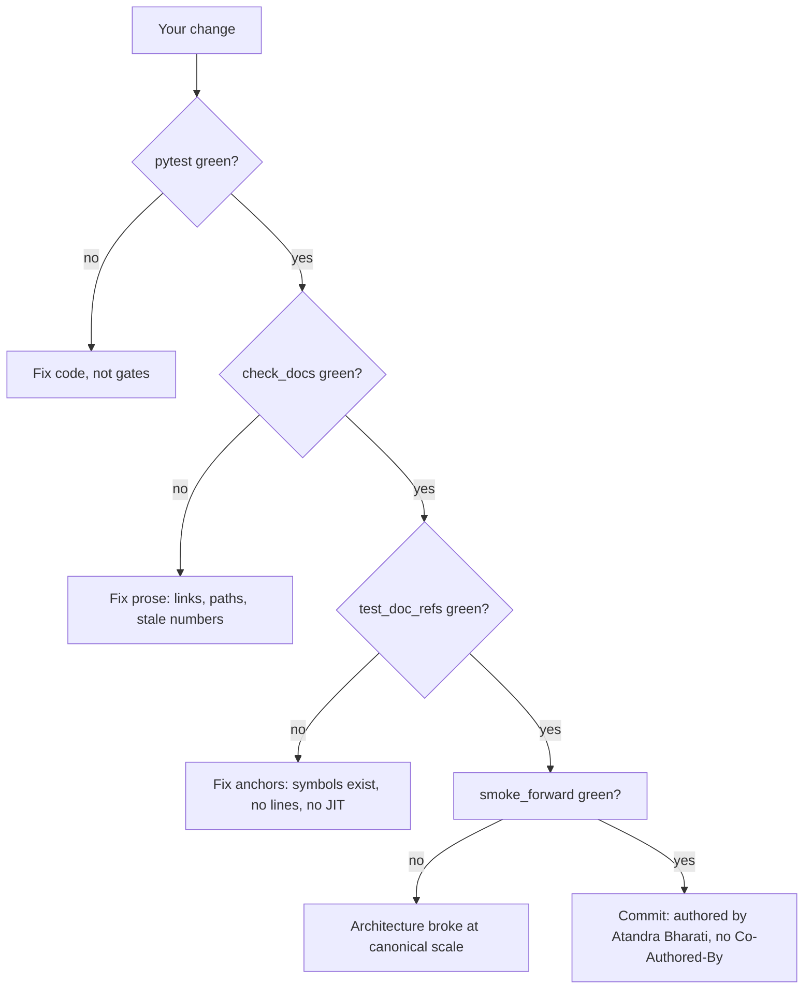

# DeepSeek-v3-Lite — Contributing

> **Status:** guide · **Applies to:** every change — code, tests, docs, CI.
> **Depends on:** [Operations, Testing & Triton Kernels](../concepts/kernels-and-ops.md) · **Read next:** [Triton Kernels](../concepts/kernels-and-ops.md) (before touching kernels), [Getting Started](../guides/getting-started.md) (if you are new)

## 60-Second Summary

Contributing to this repo is a checklist discipline, not a free-form exercise. Every change — a new test, a kernel edit, a doc paragraph — is checked by machine gates: `scripts/check_docs.py` lints prose hygiene, `tests/test_doc_refs.py:test_doc_anchors_resolve` proves every code anchor in the docs resolves against real symbols, and the pytest suite (199 nodes: 189 pass + 10 GPU-gated skips on a laptop) exercises the real `Transformer`/`Pretrainer`/`CheckpointManager` at toy scale, CPU-only. Above the gates sit the AGENTS.md hard rules — exactly two sanctioned Triton paths, the aux-loss-free bias-update mechanism, re-stack-every-forward expert weights, weight-tying dedup — and the workspace git policy (all commits authored by Atandra Bharati, never a `Co-Authored-By:` trailer). This guide walks each contract, gives the commands, and ends with checklists.

## 1. Orientation: Where Your Change Lives

### 1.1 The binding documents, in order

1. `~/.claude/CLAUDE.md` — workspace overview; contains the git commit policy (§7).
2. `~/Desktop/CoreProjects/AGENTS.md` — workspace rules; read once before any cross-project work.
3. `AGENTS.md` in this repo — project hard rules (§5 of this guide quotes them).
4. `docs/README.md` (canonical layout + style template) + §2 of this guide — binding for any docs change.

When documents disagree, the repo is the source of truth: code wins over docs, tests win over prose, current source wins over memory. If a doc contradicts `training/pretrain.py:main`, the doc is stale — fix the doc, not the code.

### 1.2 Repo map

| Directory | Holds | Typical change |
|---|---|---|
| `models/` | `transformer.py`, `mla.py`, `moe.py`, `mtp.py`, `mla_triton.py`, `moe_triton.py`, `_triton_dispatch.py` | architecture, backends |
| `training/` | `pretrain.py` (loop, `Pretrainer`, `TrainingConfig`) | optimizer, scheduler, checkpointing |
| `utils/` | `checkpoint.py`, `logging.py`, `memory.py` | save/load, logging, VRAM math |
| `inference/` | `generate.py`, `speculative.py` | sampling, speculative decode |
| `tests/` | 8 files, `conftest.py` fixtures | every behavior claim (§4) |
| `scripts/` | `check_docs.py`, `smoke_forward.py`, `microbench_a100.py`, … | dev tooling, CI steps |
| `configs/` | `pretrain_a100_422m.yaml` (canonical) | run recipes |
| `docs/` | `concepts/`, `references/R1–R9`, `guides/`, `training.md`, `inference.md` | prose (contract in §2) |

### 1.3 Decision tree: which directory?

- Changing model structure → `models/` + the matching R-reference (e.g. `references/R3_mla_api.md`) + the relevant `concepts/` doc.
- Changing the loop, LR schedule, or loss math → `training/pretrain.py` + `references/R7_training_api.md` + `training.md`.
- Changing checkpoints or logging → `utils/checkpoint.py` / `utils/logging.py` + `references/R8_utils_api.md` + `concepts/kernels-and-ops.md`.
- Changing sampling or decode → `inference/` + `references/R9_inference_api.md` + `inference.md`.
- Adding a Triton kernel → you are almost certainly *not* allowed to (see §5.1); if you are, read [G3_triton_development](G3_triton_development.md) and `concepts/kernels-and-ops.md` first.
- Any behavior claim, anywhere → add/extend a test in `tests/` (§4). "It works on my machine" is not a claim this repo accepts.

## 2. The Documentation Contract

The canonical layout and style template live in `docs/README.md`; the mandatory writer brief (`local://doc_contract.md`) applies to every docs change. Every doc — concept, reference, guide, or top-level pipeline doc — must satisfy both. The parts that get contributors in trouble:

### 2.1 Style template

Every section follows: **60-second summary → why it exists → intuition → math/proof → code walkthrough → pitfalls → check-your-understanding**. Guides are the procedural variant: summaries stay, proofs shrink to decision trees and checklists, "code walkthrough" becomes command snippets. This guide is itself an example.

### 2.2 Anchor rules (machine-enforced)

- Cite symbols as `models/mla.py:MultiHeadLatentAttention.forward` — path prefix + `Class.method` (or module-level function). Include the prefix: bare `mla.py:…` fails the gate.
- **NEVER** cite line numbers (`file.py:<line>`, `L123`). They rot; symbols do not. The gate hard-fails on them.
- **NEVER** cite JIT symbols defined under `if HAS_TRITON:` — `_mla_flash_fwd_kernel`, `_grouped_moe_fwd_kernel`, `_TritonMlaAttentionFunction`, and friends are in the gate's `JIT_SYMBOLS` ban list. Cite the always-defined host wrappers `models/mla_triton.py:triton_mla_attention` and `models/moe_triton.py:triton_grouped_moe_dispatch` instead.
- Every anchor must resolve. When in doubt, verify with a grep before citing — a red gate is a docs bug, not a CI nuisance.

Good vs bad:

| Good | Bad | Why |
|---|---|---|
| `training/pretrain.py:Pretrainer.train_step` | `training/pretrain.py:<line>` | line rot |
| `models/mla_triton.py:triton_mla_attention` | `models/mla_triton.py:<kernel-symbol>` | JIT symbol, unresolvable without triton |
| `models/moe.py:DeepSeekMoE.forward` | `moe.py:<prefix>` | missing `models/` prefix |
| `tests/test_doc_refs.py:collect_issues` | `test_doc_refs.py:<prefix>` | missing `tests/` prefix |

### 2.3 Locked constants

These are canonical; never reintroduce the old values ("422M as a param count", "189 tests", "8.04e-4"):

| Fact | Value |
|---|---|
| Params (deduped base) | 411.6M (411,632,256) — "422M" is only the config *filename* |
| Params with MTP | 418.7M (418,713,984); MTP adds ~7.1M |
| Active params per token | ~185M |
| Test suite | 199 nodes = 189 pass + 10 GPU-gated skips on a laptop |
| μP LR | `6.0e-4 × sqrt(757226496 / N)` → 8.138e-4 base / 8.069e-4 with MTP (rounded: 8.14e-4 / 8.07e-4) |
| Scheduler horizon | `max_steps // gradient_accumulation_steps` — opt-step space, per the comment in `Pretrainer.__init__` (`training/pretrain.py:Pretrainer.__init__`) |
| GPU runs | none executed — every memory/latency figure in the docs is an estimate; label it |

### 2.4 Snippets, links, honesty

- **Snippets:** copy verbatim from source; mark cuts with `…`; mark invented code `# illustrative`. Never quote "as of a past commit".
- **Links:** cross-link only to docs that exist (the files under `docs/`), via relative `.md` links. No dead `#anchor` fragments.
- **Honesty:** label measured vs derived vs `[INFERENCE]`. `.benchmarks/` is empty → numbers are estimates. Paper-spec chapters (06, 07) keep their banner.

**Doc-contribution checklist:** (1) read `docs/README.md` (layout + style template) and this guide's §2; (2) verify every anchor by grep; (3) run both gates locally (§3); (4) leave the `<!-- docs:verified … -->` footer alone — the coordinator re-stamps it; (5) never edit `docs/README.md` size tables by hand.

## 3. The Gates: What CI Actually Runs

`.github/workflows/ci.yml` (ubuntu, CPU-only torch) runs five steps in order; all five can be reproduced locally in seconds:

```bash
pip install torch --index-url https://download.pytorch.org/whl/cpu
pip install -r requirements.txt pytest pytest-cov

python -c "import models.transformer; import models.mla; import models.moe; import models.mtp"   # import surface
python scripts/check_docs.py                                                                    # prose hygiene
python -m pytest tests/test_doc_refs.py -q --tb=short                                           # symbol truth
python -m pytest tests/ -q --tb=short                                                            # full suite
python scripts/smoke_forward.py                                                                  # full-size forward
```

### 3.1 `scripts/check_docs.py` — prose hygiene

Lints every `docs/**/*.md` (via `scripts/check_docs.py:iter_doc_files`, which `rglob`s subfolders so `references/` and `guides/` are covered): control characters, stale patterns (the banned curly-brace thousand-separator form, old test counts, corrupted math), broken internal `.md` links (resolved relative to the doc, so a guide links up with `../`), and backtick-quoted repo paths that do not exist. It also refreshes the size table and `docs:verified` footers with `--update-sizes` / `--stamp-footers`.

**Failure → fix:** a broken link or a missing backtick path is a typo in your prose — fix the reference, not the checker.

### 3.2 `tests/test_doc_refs.py` — semantic truth

`tests/test_doc_refs.py:test_doc_anchors_resolve` scans every markdown file under `docs/**` plus the root `README.md`/`AGENTS.md`/`SKILLS.md` and applies three rules via `tests/test_doc_refs.py:collect_issues`:

1. **Anchors resolve.** One regex extracts `<path>.py:<symbol>` pairs; each module is imported *as a package* (`models/mla.py` → `importlib.import_module("models.mla")` so relative imports work), and the gate walks a `hasattr` chain through the dotted symbol.
2. **Line anchors banned.** A `.py` path followed by `:<digits>` is a hard failure.
3. **JIT cites banned.** Kernel symbols under `if HAS_TRITON:` are rejected; cite host wrappers.

A small allowlist covers paper-spec/planned files (`training/loss_triton.py`, `scripts/microbench_a100_triton.py`, `models/__init__.py`, …). Run it as a test or as a script:

```bash
python -m pytest tests/test_doc_refs.py -q --tb=short
python tests/test_doc_refs.py
```

**Failure → fix:** the error names the doc, line, and reason (`missing-symbol: X`, `line anchor banned`, `JIT symbol (cite host wrapper)`). Rename your anchor to a symbol that exists — never weaken the gate.

### 3.3 The pytest suite and the forward smoke test

`python -m pytest tests/ -q --tb=short` runs the full 199-node suite, under 20 s on a laptop, no GPU required. `scripts/smoke_forward.py:main` then builds the canonical 411.6M-param `Transformer` from `configs/pretrain_a100_422m.yaml` (with `max_seq_len` shrunk to 16) and asserts the logits shape `(2, 16, vocab_size)` — the closest CI comes to the real model. Note that steps 3–6 run even if the suite fails, so a push cannot hide doc drift behind a test failure.



## 4. Test Conventions

### 4.1 CPU-first is a design goal

The suite proves the *real* code at toy scale: same `Transformer`, `Pretrainer`, `CheckpointManager`, just small shapes. That is why a bug in MLA absorption or sharded-dataset `_locate` fires on a laptop exactly as it would on an A100. Consequences: tests must never require CUDA, Triton, or network; everything runs under 20 s; and a new test that needs a GPU is a design smell unless it is genuinely kernel behavior (see §4.3).

### 4.2 Fixture configs

`tests/conftest.py` provides the shared, session-scoped fixtures: `tests/conftest.py:cfg` (the 82M-style architecture truncated for speed, still `vocab_size=100018`), `tests/conftest.py:small_cfg` (even smaller, for component tests), `tests/conftest.py:device` (CPU), `tests/conftest.py:training_cfg` (loop parameters), plus token/target tensors and tmp-dir helpers. Training-loop tests build a `TrainingConfig` from `cfg` with tiny loop parameters (`max_steps=4`, `gradient_accumulation_steps=2`, `fused=False` for CPU AdamW). **Rule:** if a test needs a model config, consume a fixture — never hand-roll a divergent dict in the test body.

### 4.3 The 8 test files and what each guards

| File | Guards |
|---|---|
| `tests/test_models.py` | architecture: shapes, weight tying, residual stream, chunked-prefill parity, gradient flow |
| `tests/test_training.py` | loop: scheduler boundaries, `PretrainDataset` `_locate`, checkpoint round-trip, μP LR boundary, NaN-guard rollback |
| `tests/test_utils.py` | `CheckpointManager` (incl. shared-tensor dedup, crash recovery), memory byte-arithmetic |
| `tests/test_moe_triton.py` | `grouped_moe_pytorch` reference, import surface, dispatch wiring, GPU kernel |
| `tests/test_inference.py` | `generate` sampling params, `SpeculativeDecoder` accept/reject |
| `tests/test_force_back.py` | `tests/test_force_back.py:TestEnforceTritonEnvVar` — every Triton key force-backs without `ENABLE_TRITON_KERNELS=1` |
| `tests/test_mla_triton.py` | `mla_attention_reference` (incl. causal `q_start` contract), import surface, GPU kernel |
| `tests/test_doc_refs.py` | the doc↔code alignment gate (§3.2) |

### 4.4 GPU-gated tests

GPU-only behavior is gated with `pytest.mark.skipif(not (HAS_TRITON and torch.cuda.is_available()), reason="requires triton + CUDA")` — the `gpu_required` alias in the Triton test files — and auto-skips on CPU-only machines. The 10 skips on a laptop are: 9 tests inside the `TestMlaTritonKernelGPU` (3) and `TestMoeTritonKernelGPU` (6) classes, plus 1 import-surface test that skips when triton is absent. The full-model agreement test lives at `tests/test_mla_triton.py:TestMlaTritonKernelGPU.test_full_model_sdpa_and_triton_agree`.

**New Triton kernel test contract (AGENTS.md rule 8), all in `tests/test_<kernel>_triton.py`:**

1. Compare the Triton path against the pure-PyTorch reference within `atol=1e-2` for BF16.
2. Run `torch.autograd.gradcheck` on a float32 tiny config.
3. Run a shape / dtype / NaN-finite test on random input.
4. The reference comparison must run on CPU **without** triton installed.
5. GPU-only behavior goes in the `@gpu_required` class — never a hard CUDA import at module top level.

**Checklist for adding a test:** pick the fixture (never inline a config); assert an observable contract (shape, invariant, boundary, parity — not "it did not crash"); keep it deterministic and full-suite-safe; run `python -m pytest tests/test_<file>.py -v` before claiming green.

## 5. AGENTS.md Hard Rules (the Ones That Bite)

These are quoted from `AGENTS.md` in this repo. Violations are review-blocking.

### 5.1 Exactly two sanctioned Triton paths

**Rule:** raw PyTorch by default; custom Triton kernels are first-party for *exactly* two hot paths — MoE routed-expert dispatch (`models/moe_triton.py`) and MLA attention materialisation (`models/mla_triton.py`). No other component gets a custom kernel without updating `AGENTS.md` and `concepts/kernels-and-ops.md`. The bulk of the codebase (RMSNorm, SwiGLU, embeddings, LM head, gate, MLA SDPA, MTP, inference) stays raw PyTorch; no HuggingFace Trainer, no Lightning. For the two sanctioned paths, the target is ≥1.5× speedup over the raw-PyTorch path in `scripts/microbench_a100.py`; below that bar, do not enable by default.

Kernel contract, both files: `import triton` is optional at import time (`HAS_TRITON = False` on failure); each file ships a pure-PyTorch reference in the same file (`models/mla_triton.py:mla_attention_reference`, `models/moe_triton.py:grouped_moe_pytorch`) that CPU tests use; the kernel is a `torch.autograd.Function` whose `forward` saves only what `backward` needs to re-compute (FA2 re-compute pattern); GEMM accumulators are fp32 while I/O stays BF16; block sizes are `tl.constexpr` and autotuned over a small grid, pre-warmed at `__init__`.

### 5.2 Re-stack every forward

**Rule:** expert weights are re-stacked every forward — never cache `_stacked_w*` across optimizer steps. The stacked layout (one bmm per SwiGLU projection, built in `models/moe.py:DeepSeekMoE.forward`) must be rebuilt from the per-expert parameters each call, because the optimizer mutates those parameters in place; a cached stack silently trains a stale copy. If you are tempted to cache for speed, the correct response is the Triton grouped path, which does not materialise a stack at all.

### 5.3 Preserve the bias-update mechanism

**Rule:** always preserve the `AuxLossFreeGate` bias-update mechanism. The per-expert bias is a differentiable-free load-balancing signal: `models/moe.py:AuxLossFreeGate.update_bias` adjusts `self.bias` from observed token-count deviation out-of-band in Python every `bias_update_every` steps; the Triton MoE kernel fuses only the forward. Do not move the bias into the kernel, and do not add an auxiliary loss term — the whole point is no gradient contamination. The training side is `training/pretrain.py:Pretrainer._update_moe_bias`, called from `training/pretrain.py:Pretrainer.train_step` every `bias_update_every` optimizer steps (`TrainingConfig.bias_update_every`, default 10). `DeepSeekMoE.update_gate_bias` (`models/moe.py:DeepSeekMoE.update_gate_bias`) keeps counts on the bias's device.

### 5.4 Weight-tying dedup

**Rules:** the embedding dim must match `vocab_size` (100,018 — the tokenizer has unusual `byte_fallback` tokens), and the LM head is tied to the embedding (`head.weight IS embed.weight` — one tensor). Two places this bites: `models/transformer.py:count_parameters` dedups by tensor id (that is how 411.6M, not a naive sum, is the honest number), and `utils/checkpoint.py:CheckpointManager._atomic_save_safetensors` drops duplicate keys by `data_ptr()` so a shared tensor is saved once and restored via `load_state_dict(strict=False)` through the surviving storage. If you add a module, keep the tie; if you break it, param counts and checkpoint sizes change together.

### 5.5 NaN guard and no-silent-fallback

**Rules:** never disable the NaN guard without explicit user consent — after 5 consecutive NaN/Inf micro-steps (`nan_guard_max_consecutive`), `Pretrainer.train` rolls back to the last complete checkpoint (`training/pretrain.py:Pretrainer.train`). And never let a Triton kernel *silently* fall back during a default-config run: Triton is explicit opt-in (`attn_impl: "triton"` / `moe_dispatch: "triton_grouped"` in YAML plus `ENABLE_TRITON_KERNELS=1`). The master guard is `models/_triton_dispatch.py:enforce_triton_env_var`, called from both `Transformer.__init__` and `Pretrainer.__init__`; with the env-var unset, any Triton dispatch key is force-backed to its PyTorch default with a single construction-time warning — never 32 per-layer warnings. With the env-var set but the kernel failing (e.g. the canonical MoE config exceeds the I, D ≤ 256 register cap), the run must surface a clear error or an explicit one-time fallback notice, never silence. Known trap: `ENABLE_TRITON_KERNELS=1` must prefix the *launch*; exporting it after Python starts does not count.

## 6. Code Style

The repo's comment rules (AGENTS.md rule 9), with verifiable targets:

- **Public function docstring:** ≤ 3 lines (or one short paragraph); **module docstring:** ≤ 6 lines; **inline comments:** ≤ 1 per ~10 lines of code on average, and only when the code is opaque — `# compute x`, `# loop over rows` are forbidden; **section banners** (`# ---- … ----`): ≤ 3 per file at the top level, plus inside kernels to delimit named algorithm phases.
- Comments must justify *why*, never restate *what*. `wc -l <file>` and `grep -c '^[[:space:]]*#' <file>` are the reviewable metrics.
- **Raw PyTorch discipline:** no high-level wrappers; stdlib/`torch` idioms before bespoke abstractions; delete dead code, aliases, and deprecated re-exports on cutover — no shims.
- **dtype discipline:** BF16 autocast in training, fp32 accumulators everywhere that matters (AdamW master weights, kernel GEMM accumulators); token tensors arrive as uint32 from the dataset and are cast to int64 at the entry boundary (`Transformer.forward`, `training/pretrain.py:Pretrainer.train_step`) — bypassing an entry point means casting yourself.
- **Atomicity discipline:** checkpoints write `.tmp` then `os.rename`; safetensors for weights, `.pt` for optimizer, `.json` for meta — never pickle. Follow the pattern in `utils/checkpoint.py:CheckpointManager.save`.

## 7. Git and Process Conventions

- **No `Co-Authored-By:` trailers, ever.** The workspace policy (in `~/.claude/CLAUDE.md`) applies to every repo: all commits are authored by Atandra Bharati only; no Claude/Anthropic attribution lines in commit bodies or PR descriptions. GitHub parses those trailers into its contributor list.
- **Commit hygiene:** short imperative subjects, one reviewable unit per commit, no `Generated with Claude Code` attribution.
- **Verification before commit:** run the relevant file, not the world — `python -m pytest tests/test_utils.py -v` is 1–2 s; the full suite is under 20 s. Evidence before assertions, always.
- **Vault mirror:** every new/modified `.md` under `~/Desktop/CoreProjects` is mirrored to `~/Documents/obsidian` via `bash ~/Desktop/CoreProjects/scripts/sync_to_vault.sh` — never hand-edit the mirror.

**Final PR checklist:** (1) all four gates green locally (§3); (2) new tests exist for new behavior and are CPU-runnable; (3) doc anchors resolve, zero line anchors, constants current; (4) AGENTS.md rules §5 respected — especially the two-Triton-path limit and the bias mechanism; (5) no `Co-Authored-By:`; (6) vault synced.

## 8. Check Your Understanding

**Q1.** You cite a kernel symbol defined under `if HAS_TRITON:` — say `_mla_flash_fwd_kernel` with a `models/mla_triton.py:` prefix — in a doc. What happens in CI?
**A.** The gate fails with `JIT symbol (cite host wrapper)`. Cite `models/mla_triton.py:triton_mla_attention` — the always-defined wrapper — instead.

**Q2.** Why must expert weights be re-stacked every forward rather than cached?
**A.** The optimizer mutates the per-expert parameters in place each step; a cached `_stacked_w*` would silently train a stale copy (AGENTS.md rule; see §5.2).

**Q3.** `ENABLE_TRITON_KERNELS=1` is set inside your launch script's body, and the log still shows the force-back warning. What happened?
**A.** The env-var must prefix the process launch (`ENABLE_TRITON_KERNELS=1 python training/pretrain.py …`); exporting it after Python starts doesn't reach `models/_triton_dispatch.py:enforce_triton_env_var`.

**Q4.** Your change touches the MoE gate. What must you not do?
**A.** Do not move the bias into the Triton kernel and do not add an auxiliary loss: the out-of-band `AuxLossFreeGate.update_bias` mechanism is a hard rule, and the kernel fuses only the forward (§5.3).

## References

- [docs/README.md](../README.md) — canonical layout + style template
- [R6 — Triton API](../references/R6_triton_api.md) - kernel contract the two sanctioned paths must satisfy
- [Operations, Testing & Triton Kernels](../concepts/kernels-and-ops.md) — the gates subject matter
- `tests/test_doc_refs.py`, `scripts/check_docs.py` - the machine gates
