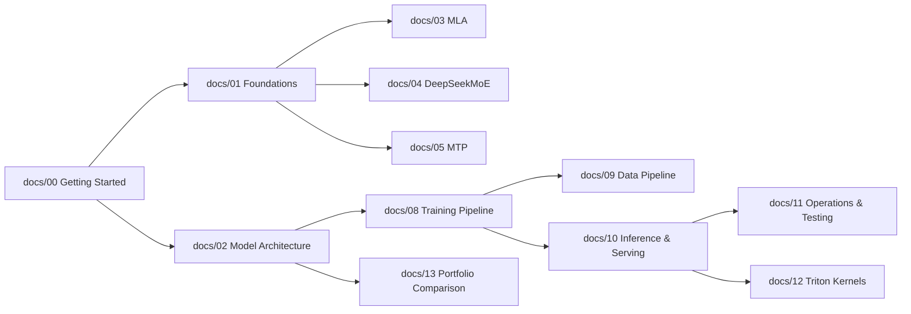

# DeepSeek-v3-Lite — Getting Started

> **Canonical** for DeepSeek-V3 onboarding, environment setup, smoke tests, and canonical numbers. Educational textbook chapter.

> Your first stop: what DeepSeek-v3-Lite is, how to run it, and where to read next. Architecture, MLA math, DeepSeekMoE routing, MTP, and FP8 precision depth live in the chapter sequence starting at [01 Foundations](../concepts/foundations.md).

**Depends on:** (none) · **Read next:** [Foundations & Architecture](../concepts/foundations.md)

---

## 0. Sixty-Second Summary

**DeepSeek-v3-Lite** is a from-scratch, raw-PyTorch reproduction of **DeepSeek-V3** (DeepSeek-AI, 2024) sized for single-GPU study: 18 transformer layers, MLA attention, a DeepSeekMoE block with 20 routed experts, and a depth-1 MTP head. It has **411.6M deduped parameters** (418.7M with MTP) and activates ~185M parameters per token. The full test suite (**199 tests**: 189 pass, 10 GPU-gated skips) runs on a CPU-only laptop, so you can study and verify the architecture without any GPU. This page takes you from `git clone` to a verified forward pass in about ten minutes, then routes you into the chapter sequence below.

---

## 1. Overview & Core Innovations

**DeepSeek-v3-Lite** is a from-scratch PyTorch reproduction of **DeepSeek-V3** (DeepSeek-AI, 2024) at Chinchilla-optimal scale (~412M params; 411.6M deduped base, 418.7M with MTP). It incorporates four seminal architectural breakthroughs from DeepSeek:

1. **Multi-Head Latent Attention (MLA)** — Low-rank KV compression ($d_c = 192$) with decoupled RoPE ($d_R = 24$) reduces KV cache memory consumption by over $75\%$ while outperforming standard Multi-Head Attention.
2. **DeepSeekMoE with Aux-Loss-Free Balancing** — 20 fine-grained routed experts (4 activated per token) + 1 always-active shared expert. Load balancing is achieved without auxiliary loss penalties by dynamically adjusting expert bias terms ($b_i \leftarrow b_i + \gamma \cdot \text{sign}(\text{target} - \text{load})$).
3. **Multi-Token Prediction (MTP)** — Sequential MTP modules (depth 1) predict next-token targets $t+1$ and $t+2$ simultaneously, densifying training signals and enabling zero-overhead speculative decoding.
4. **$\mu\text{P}$ Learning Rate Scaling & optional fused Triton kernels** — Maximal Update Parameterization ($\mu\text{P}$) scaling transfers the LR across widths; optional fused Triton kernels accelerate MLA attention and grouped MoE GEMM in BF16. *(DeepSeek-V3's FP8 mixed precision and DualPipe parallelism are paper techniques documented in [06 FP8 Mixed Precision](../concepts/attention-and-precision.md) and [07 DualPipe Parallelism](../concepts/parallelism.md) but not implemented in this single-GPU BF16 repo.)*

---

## 2. Model Architecture at a Glance

```
Input Tokens (vocab = 100,018)
    │
    ▼
Embedding (dim = 768) ──────────────────── [ Weight-tied with LM Head ]
    │
    ▼
18 × Transformer Blocks (Gradient Checkpointing enabled):
    ├─ Layer 0–1:  RMSNorm → MLA (c_KV=192, qk_rope=24) → RMSNorm → Dense SwiGLU (d_ff=1536)
    └─ Layer 2–17: RMSNorm → MLA (c_KV=192, qk_rope=24) → RMSNorm → DeepSeekMoE (20 Routed + 1 Shared)
    │
    ▼
Final RMSNorm → Linear Output Head → Cross-Entropy Loss (Main Branch)
    │
    ▼
MTP Module (Depth 1) ───> Predicts t+2 Token ───> MTP Loss (Weight = 0.3)
```

---

## 3. Canonical Parameters & Configuration

| Parameter | Canonical Value | Description |
|---|---|---|
| **Total Parameters** | **~412M** (411.6M deduped base) | ~185M active params per token |
| `dim` ($d_{\text{model}}$) | **768** | Hidden embedding dimension |
| `n_layers` | **18** | 2 Dense layers + 16 MoE layers |
| `n_heads` | **12** | Query attention heads |
| `kv_lora_rank` ($d_c$) | **192** | Compressed KV rank dimension |
| `qk_nope_head_dim` | **48** | Non-positional query/key head dimension |
| `qk_rope_head_dim` ($d_R$) | **24** | Decoupled RoPE head dimension |
| `v_head_dim` | **64** | Value head dimension |
| `n_routed_experts` | **20** | Fine-grained routed experts |
| `n_shared_experts` | **1** | Always-active shared expert |
| `n_activated_experts` | **4** | Routed experts selected per token |
| `inter_dim` / `moe_inter_dim` | **1536 / 384** | SwiGLU FFN expansion / Expert FFN dimension |
| `vocab_size` | **100,018** | DeepSeek BPE Tokenizer |
| `mtp_depth` / `mtp_loss_weight` | **1 / 0.3** | MTP depth & auxiliary loss weight |

> [!NOTE]
> Configuration file: [`configs/pretrain_a100_422m.yaml`](../../configs/pretrain_a100_422m.yaml). The filename's "422m" is a **historical nominal** — the actual deduped parameter count is 411,632,256 (411.6M base; 418.7M with the MTP head's ~7.1M). Never quote "422M" as a parameter count.

---

## 4. What You Need to Know First

### 4.1 Prerequisites and non-prerequisites

**Why this section exists:** the fastest way to get stuck on this repo is not the architecture — it is three small conventions: *shapes*, *dtypes*, and *where you run commands from*. None of them is deep; all of them bite newcomers.

You need, at minimum:

- **Python 3.10+** and **PyTorch 2.4+** (`requirements.txt` pins `torch>=2.4.0`).
- Comfort reading tensor shapes and moving small tensors around (`tensor.shape`, `tensor.to(device)`, `torch.randint`).
- A rough picture of an autoregressive language model: given token sequence $x_{1:t}$, predict a distribution over the next token $x_{t+1}$; training maximizes the probability of the observed next token (cross-entropy).
- Basic PyTorch module literacy: `nn.Module`, `forward()`, `nn.Linear`, `nn.Embedding`. You do **not** need CUDA knowledge, Triton, HuggingFace `Trainer`, or any distributed-training background — this is a single-GPU, no-framework repo.

**Intuition:** think of the entire model as one function with a fixed shape contract:

$$\text{tokens } (B, S) \;\longrightarrow\; \text{logits } (B, S, V)$$

where $B$ = batch size, $S$ = sequence length, $V$ = vocab size (100,018 for the canonical config). Everything else — MLA, MoE routing, MTP — is detail *inside* that function. The docstring on `models/transformer.py:Transformer.forward` states it verbatim:

```python
"""(bsz, seqlen) -> (bsz, seqlen, vocab_size). start_pos: KV-cache offset."""
```

### 4.2 Dtype conventions

Two dtype rules matter in practice:

- **Token ids must be `torch.long`.** `nn.Embedding` rejects other integer dtypes. The mmap'd token shards are `uint32` (8.4B tokens stay at ~32 GB on disk instead of ~64 GB), so the cast happens at the model boundary — `models/transformer.py:Transformer.forward` accepts `uint32` and casts internally.
- **Training runs in BF16** (`dtype: bf16` in the config, with FP32 master weights in the optimizer). On CPU you can run the suite as-is; nothing in the tests requires a GPU.

### 4.3 Run everything from the repo root

Config and data paths in the codebase are repo-root-relative (`configs/…`, `data/…`). `scripts/smoke_forward.py` opens `Path("configs/pretrain_a100_422m.yaml")` relative to the *current working directory*, so invoke it from the repo root. The bundled scripts self-insert the repo root onto `sys.path` (so `from models.transformer import Transformer` works without an editable install), but they cannot fix your CWD for relative config paths.

### 4.4 Sanity-check your environment

```bash
python3 --version                                   # ≥ 3.10
python3 -c "import torch; print(torch.__version__)" # ≥ 2.4
```

If `torch` is missing, install the requirements (next section) before continuing.

---

## 5. Installation

### 5.1 Option A — CPU laptop / Mac dev box (default)

Everything except the Triton kernel paths and GPU benchmarks runs on CPU, so a plain laptop is a fully valid dev environment.

```bash
git clone https://github.com/atandra2000/DeepSeek-V3-Lite.git
cd DeepSeek-V3-Lite
python3 -m venv .venv
source .venv/bin/activate
pip install -r requirements.txt
```

`requirements.txt` installs the runtime deps (`torch`, `transformers`, `datasets`, `huggingface_hub`, `safetensors`, `tqdm`, `numpy`, `pyyaml`) plus the test-only deps (`pytest`, `pytest-cov`) in one shot. Verify with:

```bash
python3 -c "import torch, transformers, safetensors, yaml; print('imports OK')"
```

**Why this works without a GPU:** attention uses `F.scaled_dot_product_attention` (`attn_impl: "sdpa"`), which runs on CPU and CUDA alike; there is zero custom CUDA in the training path; and the Triton kernels are compile-time optional, gated behind `ENABLE_TRITON_KERNELS=1` (see §8, row 5). The pytest suite pins the CPU device via the `device` fixture in `tests/conftest.py`.

### 5.2 Option B — A100 80GB GPU (the target hardware)

The canonical config `configs/pretrain_a100_422m.yaml` targets one A100 80GB SXM: TF32 matmuls, BF16 autocast, `torch.compile(mode="max-autotune")`, gradient checkpointing, and an 8.4B-token Chinchilla-optimal run projected at ~30–45 h at ~30–35 GB peak VRAM. **No GPU training run has ever executed** — every memory/latency figure in this repo is an estimate from `utils/memory.py:estimate_model_memory_gb` plus the microbenchmark script, not a measurement.

```bash
# Install a CUDA-enabled torch build (Linux): the default pip index wheel includes CUDA.
pip install torch --index-url https://download.pytorch.org/whl/cu124   # or your CUDA version

# Verify the GPU is visible to PyTorch
python3 -c "import torch; print(torch.cuda.is_available()); print(torch.cuda.get_device_name(0))"
```

`scripts/launch_a100.sh` runs its own pre-flight: it asserts `torch.cuda.is_available()` and **≥ 75 GB VRAM** before launching, and refuses to start otherwise. The full A100 launch sequence (tests → GPU microbench → data prep → launch) is in §6.

### 5.3 Option C — GTX 1650 4GB smoke config (smallest viable GPU)

`configs/pretrain_1650_2m.yaml` is a ~2M-parameter miniature with the *same architecture features* — MLA, aux-loss-free MoE, MTP — sized to fit 4 GB: `dim=64`, 4 layers (2 dense + 2 MoE × 4 routed + 1 shared expert), 1 activated expert, `max_seq_len=128`, `kv_lora_rank=16`. Two deliberate differences from the canonical config:

- **GPT-2 vocab (50,257)** instead of deepseek-coder-v2-lite — avoids HuggingFace authentication for the DeepSeek tokenizer, so the smoke path works offline.
- **`compile: false` and `grad_checkpoint: false`** — `torch.compile` can OOM on 4 GB; eager PyTorch is fast enough at this size.

This config drives the end-to-end GPU pipeline test `scripts/e2e_test_gpu.py:main` (data → train step → checkpoint round-trip with MTP → KV-cache generation → speculative decode → peak VRAM < 4 GB) and is the scale model for the `small_cfg` test fixture. It is the right choice whenever you want to exercise the *full loop* on hardware too small for the real run.

---

## 6. Environment & Quickstart

```bash
# 1. Clone repository
git clone https://github.com/atandra2000/DeepSeek-V3-Lite.git
cd DeepSeek-V3-Lite

# 2. Install requirements
pip install -r requirements.txt

# 3. Verify the install (full checklist with expected output in §7)
python3 -m pytest tests/ -q
python3 scripts/smoke_forward.py

# 4. Launch pretraining on A100 GPU
python3 training/pretrain.py --config configs/pretrain_a100_422m.yaml
```

### 6.1 Command reference

**CPU smoke (any machine):**

```bash
python3 -m pytest tests/ -q                       # 189 passed, 10 skipped — see §7.1
python3 scripts/smoke_forward.py                  # full 422M config, tiny input — see §7.2
python3 scripts/check_docs.py                     # doc linter — see §7.3
```

**A100 launch sequence** (from `scripts/launch_a100.sh` and the README):

```bash
python3 -m pytest tests/ -q                       # 1. CPU correctness
python3 scripts/microbench_a100.py                # 2. VRAM headroom (CUDA required)
python3 data/prepare_data.py --stage pretrain     # 3. build data/pretrain_chinchilla (once)
bash scripts/launch_a100.sh                       # 4. ~30–45 h on A100 80GB (estimated)
```

`scripts/launch_a100.sh` runs in the background (`nohup`), writes the log to `checkpoints/pretrain_a100/train.log`, and refuses to start if the `shard_*.bin` files are absent. To resume a run:

```bash
python3 training/pretrain.py --config configs/pretrain_a100_422m.yaml --resume <step>
```

The training entry point (`training/pretrain.py:main`) accepts `--config`, `--data-path`, `--checkpoint-dir`, `--resume`, `--no-checkpoint`, and `--no-compile`.

**GTX 1650 smoke:**

```bash
python3 scripts/build_small_pretrain_data.py      # writes data/pretrain_chinchilla/shard_0000.bin (self-contained, no shared_data needed)
python3 training/pretrain.py --config configs/pretrain_1650_2m.yaml
python3 scripts/e2e_test_gpu.py --config configs/pretrain_1650_2m.yaml --train-steps 20
```

**Inference on a trained model:**

```python
from models.transformer import Transformer

model = Transformer(cfg).to("cuda")
model.generate(input_ids, max_new_tokens=512, temperature=0.7, top_p=0.9)
```

`models/transformer.py:Transformer.generate` is the autoregressive decode loop (KV-cache, top-p/top-k sampling via `Transformer._sample`). The MTP head enables speculative decoding:

```python
from inference.speculative import SpeculativeDecoder

decoder = SpeculativeDecoder(model, mtp_module, acceptance_threshold=0.8)
tokens = decoder.generate(prompt_ids, max_new_tokens=512)
```

---

## 7. First-Run Checklist

Run these three in order; each one guards a different layer of the stack. Together they prove *install → model construction/forward → docs integrity* in about two minutes on a laptop.

### 7.1 Step 1 — `python3 -m pytest tests/ -q`

The suite has **199 test nodes**: 189 pass on CPU, and **10 are GPU-gated skips** (Triton MLA/MoE kernel agreement and CUDA chunked-prefill tests). On a CPU-only machine you should see `189 passed, 10 skipped` — that is a healthy result, not a warning (see §8, row 3). The suite covers the model (`tests/test_models.py`), training loop (`tests/test_training.py`), MLA/MoE Triton paths (GPU-gated), inference, checkpointing, and the doc-anchor gate `tests/test_doc_refs.py`.

### 7.2 Step 2 — `python3 scripts/smoke_forward.py`

This builds the **full canonical 422M model** from `configs/pretrain_a100_422m.yaml`, shrinks `max_seq_len` to 16 for speed, runs a forward pass on random `(2, 16)` token ids, and asserts the output shape. `scripts/smoke_forward.py:main`:

```python
model = Transformer(cfg)
x = torch.randint(0, cfg["vocab_size"], (2, 16))
logits = model(x)
assert logits.shape == (2, 16, cfg["vocab_size"]), (
    f"unexpected shape {logits.shape}, expected (2, 16, {cfg['vocab_size']})"
)
print(f"OK — forward pass succeeded, shape={tuple(logits.shape)}")
```

Expected output:

```
OK — forward pass succeeded, shape=(2, 16, 100018)
```

If you see this, the model constructs, the forward path executes end-to-end (embedding → 18 blocks → RMSNorm → head), and the shape contract from §4.1 holds on your machine.

### 7.3 Step 3 — `python3 scripts/check_docs.py`

The docs linter verifies every markdown link, every backtick-quoted repo path (`configs/…`, `scripts/…`, `models/…`, …), control characters, and a hardcoded stale-pattern list (banned old numbers like "189" tests or "422M-params"). Expected output:

```
check_docs: OK (31 files)
```

A non-zero exit with `check_docs: N issue(s)` means a link or path in the docs is broken — fix or report it before relying on the docs.

### 7.4 Step 4 (GPU only) — microbench

On CUDA hardware, `python3 scripts/microbench_a100.py:main` builds the 422M model with `use_checkpoint=True`, prints the deduped parameter count via `models/transformer.py:count_parameters`, estimates peak VRAM, runs forward + backward, and reports measured peak vs estimate. This is the VRAM-headroom gate before the long run.

---

## 8. Troubleshooting

| Symptom | Cause | Fix |
|---|---|---|
| `ModuleNotFoundError: No module named 'models'` | `python` invoked outside the repo root; the repo is not pip-installed, so `models` resolves only with the repo root on `sys.path` | Run from the repo root. Bundled scripts insert the root themselves (e.g. `scripts/smoke_forward.py` does `sys.path.insert(0, str(REPO_ROOT))`); bare `python -c "import models…"` from elsewhere will not |
| `ModuleNotFoundError: No module named 'shared_data'` | `data/prepare_data.py:main` delegates to the universal pipeline in the sibling `LLM/shared_data/` directory (single source of truth for the 8.4B-token corpus) | Clone/vendor `LLM/shared_data` next to this project, or use the self-contained `scripts/build_small_pretrain_data.py` for the 1650 smoke path |
| `189 passed, 10 skipped` in pytest | Expected on CPU/Mac: the skips are GPU-gated (Triton MLA/MoE kernels, CUDA chunked prefill) | None — healthy result. The GPU tests run only where `torch.cuda.is_available()` |
| Pre-flight `AssertionError: Need at least 75 GB VRAM` or `CUDA not available` | `scripts/launch_a100.sh` requires an A100-class GPU and a CUDA-enabled torch wheel | Use `configs/pretrain_1650_2m.yaml` on smaller GPUs; install the CUDA torch wheel (see §5.2) for A100; the CPU suite needs no GPU at all |
| `[warn] Triton dispatch keys set without ENABLE_TRITON_KERNELS=1; forcing …` | YAML requests `attn_impl: triton` / `moe_dispatch: triton_grouped` but the master env var is unset — `models/_triton_dispatch.py:enforce_triton_env_var` force-backs to the PyTorch default with one warning | On a CUDA box with `triton` installed: `export ENABLE_TRITON_KERNELS=1`. Otherwise accept the fallback; it is deliberate, not an error |
| `ERROR: no shard_*.bin files in data/pretrain_chinchilla` | Data prep has not run | `python3 data/prepare_data.py --stage pretrain` (needs `shared_data`), or `python3 scripts/build_small_pretrain_data.py` for the small config |
| `RuntimeError: NaN/Inf with no checkpoint to restore from` | The NaN guard (`training/pretrain.py:Pretrainer.train`) fired before the first checkpoint existed | Check LR/warmup, data quality, and dtype; see [G1 debugging playbook](../guides/G1_debugging_playbook.md) and [08 Training Pipeline](../training.md) |
| HuggingFace auth/network error for the tokenizer | `deepseek-ai/deepseek-coder-v2-lite` requires accepting terms and network access | For smoke runs use `configs/pretrain_1650_2m.yaml` (GPT-2 tokenizer, no auth); for the real run, accept the terms on HF once |
| `FileNotFoundError` for a config or data path | Config/data paths are CWD-relative | Run commands from the repo root (`scripts/launch_a100.sh` `cd`s to the root itself) |

---

## 9. Learning Path Curriculum

Follow the 14-chapter sequence under `Docs/`:

| Step | Chapter | Focus Area |
|---|---|---|
| 00 | [00 Getting Started](../guides/getting-started.md) | Onboarding, canonical numbers, smoke test execution |
| 01 | [01 Foundations](../concepts/foundations.md) | DeepSeek lineage (V1 $\rightarrow$ V2 $\rightarrow$ V3) & design choices |
| 02 | [02 Model Architecture](../concepts/foundations.md) | Full topology, tensor shapes, parameter accounting |
| 03 | [03 Multi Head Latent Attention](../concepts/attention-and-precision.md) | MLA low-rank compression, matrix absorption, RoPE |
| 04 | [04 DeepSeekMoE](../concepts/moe-mtp.md) | Fine-grained experts, shared expert, aux-loss-free bias updates |
| 05 | [05 Multi Token Prediction](../concepts/moe-mtp.md) | MTP module depth, training loss, speculative decoding |
| 06 | [06 FP8 Mixed Precision](../concepts/attention-and-precision.md) | E4M3/E5M2 precision, tile-wise & block-wise FP8 scaling |
| 07 | [07 DualPipe Parallelism](../concepts/parallelism.md) | DualPipe bidirectional pipeline parallelism & overlap |
| 08 | [08 Training Pipeline](../training.md) | Pretraining loop, AdamW, $\mu\text{P}$ scaling, NaN guards |
| 09 | [09 Data Pipeline](../concepts/data-pipeline.md) | Tokenizer, dataset mixture, mmap binary sharding |
| 10 | [10 Inference and Serving](../inference.md) | Autoregressive sampling, MLA KV decompression, speculative decode |
| 11 | [11 Operations and Testing](../concepts/kernels-and-ops.md) | Pytest suite, safetensors checkpointing, VRAM budget |
| 12 | [12 Triton Kernels](../concepts/kernels-and-ops.md) | Custom Triton kernels (MLA, MoE dispatch, FP8 GEMM) |
| 13 | [13 Portfolio Comparison](../concepts/foundations.md) | Architecture comparison vs LLaMA-3, Mamba-3, HyMo |

### 9.1 What to Read Next — routing graph

The spine is linear (00 → 01 → … → 13), but your next stop depends on *why* you are here:



- **"I want the theory, from first principles"** → [01 Foundations](../concepts/foundations.md) (RMSNorm, RoPE, weight tying, BF16 numerics, μP intuition).
- **"I want to see code immediately"** → [02 Model Architecture](../concepts/foundations.md) plus the API reference `[R2 transformer api](../references/R2_transformer_api.md)`.
- **"I want to understand MLA / MoE / MTP specifically"** → [03 Multi Head Latent Attention](../concepts/attention-and-precision.md), [04 DeepSeekMoE](../concepts/moe-mtp.md), [05 Multi Token Prediction](../concepts/moe-mtp.md) (deepen with `[R3 mla api](../references/R3_mla_api.md)`, `[R4 moe api](../references/R4_moe_api.md)`, `[R5 mtp api](../references/R5_mtp_api.md)`).
- **"I want to train something"** → [08 Training Pipeline](../training.md) then [09 Data Pipeline](../concepts/data-pipeline.md); the training loop walkthrough anchors every stage of `training/pretrain.py` (`[R7 training api](../references/R7_training_api.md)`).
- **"I want to run inference / serve / sample"** → [10 Inference and Serving](../inference.md) (`[R9 inference api](../references/R9_inference_api.md)`).
- **"I want to operate it: tests, checkpoints, VRAM"** → [11 Operations and Testing](../concepts/kernels-and-ops.md) and the ops guide `[G5 checkpoint ops](../guides/G5_checkpoint_ops.md)`.
- **"I want to dig into the Triton kernels"** → [12 Triton Kernels](../concepts/kernels-and-ops.md) with the developer guide `[G3 triton development](../guides/G3_triton_development.md)`.
- **"Something broke / I'm debugging"** → `[G1 debugging playbook](../guides/G1_debugging_playbook.md)` (NaN guard, shape errors, cache bugs, Triton fallback).
- **"I want to tune the learning rate / benchmark"** → `[G2 mup and lr tuning](../guides/G2_mup_and_lr_tuning.md)`, `[G4 benchmarking](../guides/G4_benchmarking.md)`.
- **"How does this compare to other architectures?"** → [13 Portfolio Comparison](../concepts/foundations.md).
- **"I want to contribute docs/code"** → `guides/G6_contributing` (doc contract, anchor rules, test expectations).

---

## 10. Check Your Understanding

1. The repo ships two configs, `pretrain_a100_422m.yaml` and `pretrain_1650_2m.yaml`. What does "422m" actually mean, and what is the real parameter count?
2. You run `pytest` on a Mac and see `189 passed, 10 skipped`. Is your install broken?
3. Why does `scripts/smoke_forward.py` shrink `max_seq_len` to 16 before building the model, and what exactly does it prove?
4. You set `moe_dispatch: "triton_grouped"` in a YAML config and the run starts anyway with a warning, not an error. Why?

<details>
<summary>Answers</summary>

1. "422m" is the **config filename**, a historical nominal — the actual deduped parameter count is **411.6M** base (411,632,256) and **418.7M** with the MTP head (+~7.1M). The 1650 config is a ~2M-parameter miniature with the same architecture features, sized for 4 GB GPUs. "422M" is never a parameter-count claim.
2. No — that is the expected healthy result. The 10 skips are GPU-gated (Triton MLA/MoE kernel and CUDA chunked-prefill tests); the suite is designed to be fully CPU-runnable.
3. A forward pass at full `max_seq_len=2048` is unnecessary to verify construction and the `(B, S) → (B, S, V)` shape contract; `(2, 16, 100018)` proves the same path with a fraction of the compute. It proves the model builds from the canonical config and a forward pass runs end-to-end on your machine.
4. Triton dispatch keys are gated by a master env var: without `ENABLE_TRITON_KERNELS=1`, `models/_triton_dispatch.py:enforce_triton_env_var` force-backs `triton_grouped` to the PyTorch `stacked` default with a single warning (never per-layer, never an error). Set the env var on a CUDA box with `triton` installed to take the fused path.

</details>

---

> **Next:** [Foundations & Architecture](../concepts/foundations.md) — DeepSeek architectural lineage from V1 to V3.

## References

- [Foundations & Architecture](../concepts/foundations.md) — next stop on the learning path
- [Training Pipeline](../training.md) — launch sequence, YAML reference
- [Operations, Testing & Triton Kernels](../concepts/kernels-and-ops.md) — test suite, VRAM budget, CI
- [R1 — Config Schema](../references/R1_config_schema.md) - every YAML key
